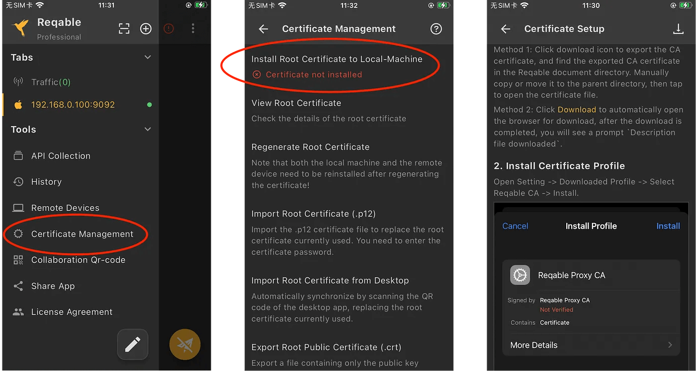

Flutter uses Dart as thed evelopment language, but Dart SDK is not proxy-aware, which means the application doesn’t use the proxy configuration of the system and sends the data directly to the server. We usually set up a network proxy for Wi-Fi to intercept the traffic. Obviously, this does not work for the Flutter application.

<!--truncate-->

In addition, on Android, Flutter has a certification verification mechanism that is different from native application.

In order to inspect Flutter HTTPS traffic, we need to solve two problems:

- Make sure the traffic can be captured.
- Let the certificate verification be approved.


# Preparation

- Windows/Mac/Linux machine, install the Reqable (recommended version 2.18.0 or more).
- Android/iOS device, install the Reqable mobile APP (requires a minimum of 2.19.0).

The principle is that the Reqable mobile app captured Flutter’s application traffic through VPN, and then forwarded to the Reqable desktop app so that we can perform traffic analysis on PC. Unlike the Wi-Fi proxy, VPN can directly capture the IP packet from the TUN interface, including the network packet sent by Dart SDK.

In this way, we solved the first problem. And next, let’s solve the second one.

# CA Certificate

First, let’s start the Reqable desktop app and complete the initialization into the home. Click on the top mobile icon to open the QR code


Next, make sure that the mobile is connected to the same Wi-Fi LAN as PC. Open the Reqable mobile app, select the collaborative mode, and scan the QR code on it to connect.


After the mobile phone is connected, now we will install the certificate. Because the traffic is sent from the mobile phone app, we need to install the root certificate on the mobile instead of PC.

When we choose the collaborative mode to initialize, it will automatically synchronize PC’s root certificate to Reqable mobile app. Next, we only need to export and install it from the mobile app.

Please note that if the mobile app is initialized in an standalone mode, the app will generate a different root certificate from PC, you need to manually synchronize the root certificate to the mobile phone from computer.

### Android

The Flutter application only trusts the certificate of the system directory and will not trust the user certificate. Native application can setup a trust anchor for user certificate with the network_security_config.xml file or reduce the targetSdkVersion to 23, but this does not work for the Flutter application.

Dart SDK only loads the certificates in /system/etc/security/cacerts, This logic is defined in the Runtime/Bin/Security_Context_linux.cc. If you are interested, you can look at the source code.

```c++
// On Android, we don't compile in the trusted root certiicates. Instead,
// we use the directory of trusted certificates already present on the
// device. This saves ~240KB from the size of the binary. This has the
// drawback that SSL_do_handshake will synchronously hit the filesystem
// looking for root certs during its trust evaluation. We call
// SSL_do_handshake directly from the Dart thread so that Dart code can be
// invoked from the "bad certificate" callback called by SSL_do_handshake.
const char* android_cacerts = "/system/etc/security/cacerts";
LoadRootCertCache(android_cacerts);
```

Therefore, anyone who tries to install the certificate to the user directory is in vain. So, how to install the certificate to the system directory, there are currently only two ways:

- Rooted device, connect to PC with USB, and install with one click via ADB.


- Download and install the magisk module from the Reqable, which requires the mobile to have a magisk environment.

The Magisk module can be downloaded from PC (see Magisk in the above), or saved from the mobile's `Certificate Management` -> `Install Root Certificate to Local-Machine` -> `Magisk`.

If the root certificate is installed successfully, the Reqable mobile app will have a prompt that has been installed.

### iOS

The iOS certificate installation is much simpler, three steps.

- Download the certificate file. You can save it directly from the Reqable mobile app, or you can start a browser to download.
- Setting -> Downloaded Profile -> Select Reqable CA -> Install.
- Setting -> General -> About -> Certificate Trust Settings -> Switch ON.



We can see that the installation of iOS device is much easier, so I generally recommend using iOS devices to intercept traffic.

# Enhanced Mode

On the mobile app, Reqable provides two types of network traffic capture mode, one is default mode, and the other is enhanced mode. Here we will briefly introduce the differences in the next two modes.

The default mode is the same as configured Wi-Fi proxy effect, but it does not require users to manually configure Wi-Fi proxy. Flow analysis of most applications, including browsers. This model can intercept the traffic of most applications, but does not include Flutter applications.

The enhanced mode can also be called TUN mode, forced to intercept all traffic, including traffic that does not go through Wi-Fi proxy, such as the Flutter applications.

By default, Android is automatically turned on the enhanced mode, and users do not need to open manually. The iOS device is somewhat special. You must connect to the collaborative device (computer) and manually open it in the title menu.


For Flutter applications, please be sure to turn on the enhanced mode. After the enhanced mode is turned on, a key 🔑 icon will appear behind the title.

# Practice and Test

First, create a Flutter default project. We simply change the code as a test application.

```
flutter create capture_test
```

Add some code, such as clicking `+` button to send an HTTP request once.

```dart
void _incrementCounter() async {
  final HttpClient httpClient = HttpClient();
  final HttpClientRequest request = await httpClient.getUrl(Uri.parse('https://httpbin.org/get'));
  request.close();
}
```

Run the Flutter application through the following command.

```
flutter run -d <your device id>
```

Finally, we turn on debugging in the mobile app, and PC will enter the intercepting status at the same time. If PC does not automatically turn on the interception, you can start it manually.

Without accidents, you should be able to successfully capture HTTPS traffic, as shown below.


If there is a prompt that `Unable to perform SSL handshake with client` in the figure below, it means that the certificate installation on the mobile phone is not successful.


In this case, there is an error can be seen in the command line console.

```
E/flutter (24436): [ERROR:flutter/runtime/dart_vm_initializer.cc(41)] Unhandled Exception: HandshakeException: Handshake error in client (OS Error:
E/flutter (24436):   CERTIFICATE_VERIFY_FAILED: unable to get local issuer certificate(handshake.cc:393))
E/flutter (24436): #0      _SecureFilterImpl._handshake (dart:io-patch/secure_socket_patch.dart:99:46)
E/flutter (24436): #1      _SecureFilterImpl.handshake (dart:io-patch/secure_socket_patch.dart:143:25)
E/flutter (24436): #2      _RawSecureSocket._secureHandshake (dart:io/secure_socket.dart:920:54)
E/flutter (24436): #3      _RawSecureSocket._tryFilter (dart:io/secure_socket.dart:1049:19)
E/flutter (24436): <asynchronous suspension>
```

Question: Only has Android device and cannot install the certificate to the system directory. So what should I do?

You have to modify your project code to ignore the certificate verification. Through this, you can also skip the previous certificate installation step, but this is will make your app insecure. So please note: Be sure to delete or bypass this code.

```dart
httpClient.badCertificateCallback = (X509Certificate cert, String host, int port) => true;
```

Question: What should I do if I don’t want to install the Reqable mobile app?

You also need to write some code, force HTTP requests go through the MITM server.

```dart
httpClient.findProxy = (url) {
  return 'PROXY <port:ip>';
};
```

Well, the problem has been resolved👏👏👏. If you have any questions, please submit an issue on Github.