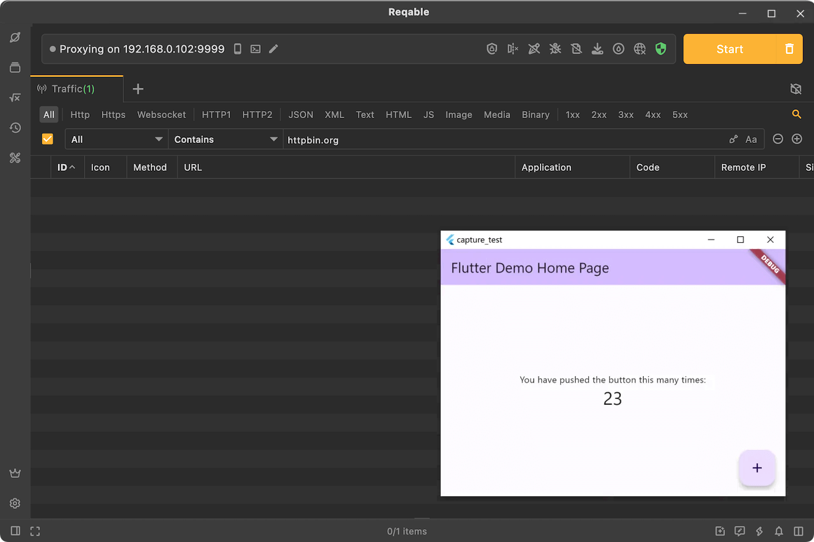

Reqable desktop app uses the system network proxy to capture traffic, but it has limitations. For example, some applications or network libraries ignore the system network proxy settings and the traffic does not go through Reqable. In this case, Proxifier is needed. This article specifically introduces how to use Proxifier and Reqable to solve this issue.

<!--truncate-->

### Principle

In order to better understand this article, I will first briefly talk about the working principle of Reqable desktop. The core principle of Reqable is to use MITM (Man-in-the-Middle) technology to start a local proxy server (listening 0.0.0.0, default port 9000) to receive proxy requests. Other applications do not know the address of this proxy server, so you need to configure the proxy address 127.0.0.1:9000 to the system network proxy settings, so that other applications can get it.

When the client (such as a browser) sends a network request, it actively connects to the proxy server to send the request, so that Reqable can get the traffic. The defect is also obvious. Whether it will read the system's network proxy and connect depends on the client's implementation. Reqable is in a passive waiting state for connection. For example, applications developed by Flutter will not read the system network proxy by default, and of course there are many other applications that do the same.

This brings a lot of inconvenience to our development and debugging. Although we can specify the proxy server to send requests in the code, there is no way to test the release version. In addition, some malicious programs will actively bypass the system proxy settings to hide traffic, which will cause a lot of trouble for security engineer to analyze the traffic.

With Proxifier, we can force the traffic of the specified application to connect to Reqable's proxy server. This principle is similar to the collaborative mode of Reqable mobile app.

### Proxifier

First of all, [Proxifier](https://www.proxifier.com) is a paid application with a 31-day trial period and a price of $39.95. Proxifier supports Windows, Mac and Android. In the following demonstration, we use the Windows version of Proxifier.

Start Proxifier directly after installation, if the window does not appear, you can open it from the system tray. Proxifier cannot be used directly and requires some configuration.

Open Profile -> Proxy Servers -> Add, and configure Reqable's proxy server. If Reqable and Proxifier are in the same device environment, fill in 127.0.0.1 for Address, and fill in Reqable's proxy port for Port, which can be seen at the top of the Reqable application. If Reqable and Proxifier are not in the same device environment, fill in the IP address of the device where Reqable is located for address, which can also be seen at the top of the Reqable application.


Next, choose the proxy protocol. Proxifier provides HTTPS, SOCKS4 and SOCKS5. All three protocols are supported by Reqable 😀, so you can choose any one. Generally speaking, HTTPS is recommended because it is simple and not prone to errors.


Finally, click OK all the way, and the basic configuration of Proxifier is complete.

By default, Proxifier will work on all processes. If you want to specify only one process for proxying, follow the steps below.

Open Profile -> Proxification Rules -> Add, and configure the executable file path of the application in Applications. You can configure multiple paths separated by commas. Then, configure the proxy options configured in the previous step in Action.


After completing this step, you also need to change the `Default` rule to Direct, which means that other traffic is allowed to pass without proxy.


The configuration of Proxifier is almost finished. For other more advanced configurations, please refer to the official website documentation or try them yourself. This article will not introduce them one by one.

### Practical and Test

We use the Flutter Windows project for demonstration because Flutter applications do not use the system proxy by default.

```shell
flutter create capture_test
```

Add some code, such as clicking the + button, to send an HTTP request.

```dart
void _incrementCounter() async {
  final HttpClient httpClient = HttpClient();
  final HttpClientRequest request = await httpClient.getUrl(Uri.parse('https://httpbin.org/get'));
  request.close();
}
```

Start the Flutter application using the following command.

```shell
flutter run -d windows
```

Click `Start` button on the Reqable desktop to enter debugging mode and configure the system proxy. No matter how many times you click the `+` button in the Flutter app, Reqable will not receive any traffic from httpbin.org.



Now it's time for Proxifier to come on stage. If you didn't configure a specific process proxy for Proxifier before, just open Proxifier. Of course, you can also configure a specific process separately.

We click the `+` button in the Flutter app again, and Proxifier will pop up a window asking whether to allow Reqable.exe to connect directly to avoid loops. Please be sure to click allow. If you don't allow, the network request will have a loop. Proxifier forwards traffic to Reqable, intercepts Reqable's outcoming traffic, and then forwards it to Reqable. This is a traffic loop that never stops. If you click allow, Proxifier will automatically create a direct connection rule for Reqable.


If nothing goes wrong, you can see the data packets of httpbin.org in the Requestable. Since the traffic is forwarded from Proxifier, the Application column also shows Proxifier.


:::info
When using Proxifier, no need to configure the system proxy, which can reduce unnecessary traffic interference.
:::