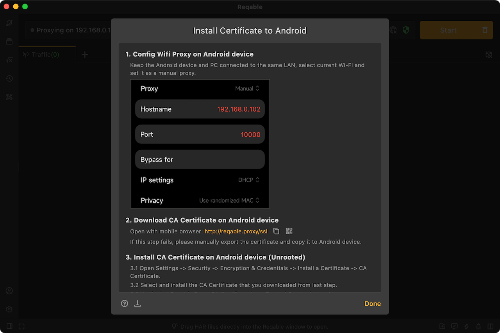
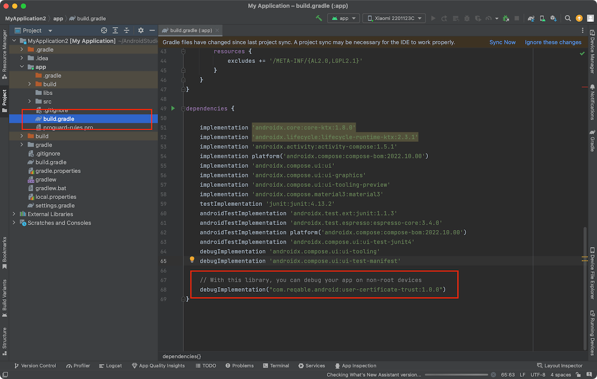
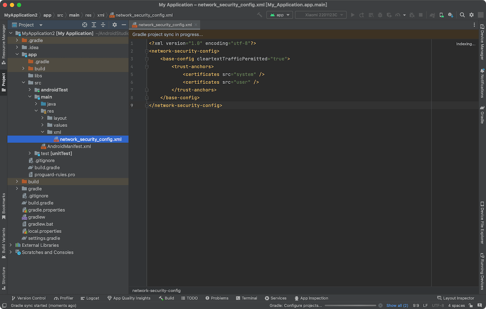

For non-rooted Android devices, CA certificates can only be installed in the user directory. However, after Android 7.0, the client cannot trust the CA certificate in the user directory, resulting in SSL handshake failure. So, how to solve this problem?

<!--truncate-->

:::caution
Requirements:

- You must have the source code modification permission of the target debugging app.
- This solution is valid for Android native apps, but not for apps developed with Flutter.

If you do not meet the above conditions, you should skip this article and check [the solution for root devices](https://reqable.com/en-US/docs/getting-started/installation/#android).
:::

### Install the CA certificate to the user store

Reqable provides a very detailed user CA certificate installation instructions. You can choose to download the CA certificate through the Desktop Reqable or the Mobile Reqable, and complete the installation of the CA certificate through the instructions.

If you use Desktop Reqable, the most important step is to connect the Android device to the same LAN as the PC device and set up a Wi-Fi proxy on the Android device. Only in this way can you open the browser on the Android device to download the CA certificate. If you cannot complete this step, you can consider saving the certificate file on the Desktop Reqable, and then use the ADB tool to push the certificate file to the mobile.



If you are using Mobile Reqable, select collaborative mode when initializing Reqable and scan the QR code to connect to Reqable on your computer, then save the CA certificate file directly in Mobile Reqable on your android device.

The next step is to install the CA certificate file saved above into the user certificate store on your phone. The steps are: Settings -> Security -> Encryption and Credentials -> Install Certificate -> CA Certificate.

### Configure network security files

The following step is the most important, you must complete this step.

Use Android Studio to open the source code project of the target debugging App, and open the `build.gradle` or `build.gradle.kts` file in the app directory.

Configure this line in dependencies:

```grovvy
debugImplementation("com.reqable.android:user-certificate-trust:1.0.0")
```



Recompile, and the debug package can be captured and debugged normally. If you want to capture the release package, remove `debug` or change it to `release`.

If you are in an intranet or cannot access the Maven central repository, you can manually configure it as follows:

Step 1: Create file res/xml/network_security_config.xml

```xml
<?xml version="1.0" encoding="utf-8"?>
<network-security-config>
  <base-config cleartextTrafficPermitted="true">
    <trust-anchors>
      <certificates src="system" />
      <certificates src="user" />
    </trust-anchors>
  </base-config>
</network-security-config>
```

Step 1: Config in AndroidManifest.xml

```xml
<?xml version="1.0" encoding="utf-8"?>
<manifest>
  <application android:networkSecurityConfig="@xml/network_security_config">
    ...
  </application>
</manifest>
```
