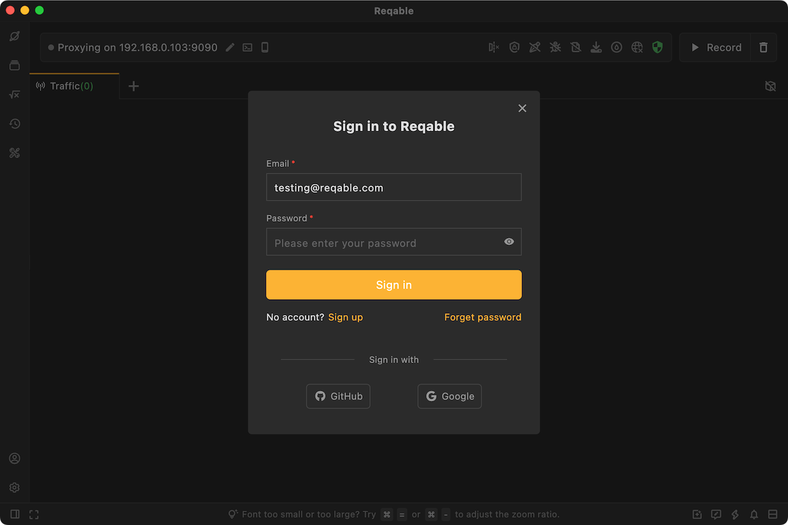
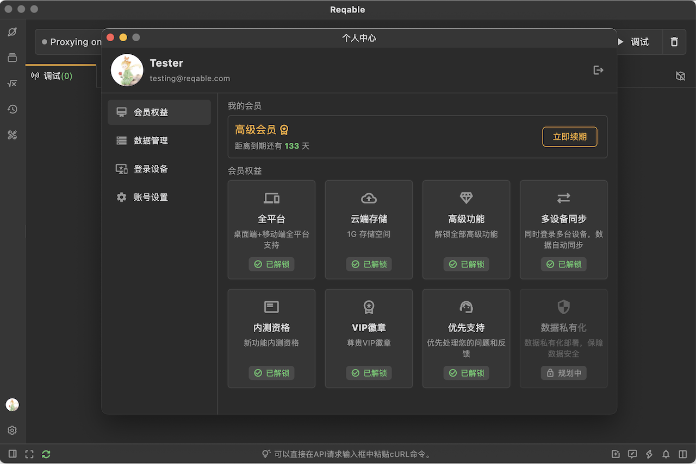
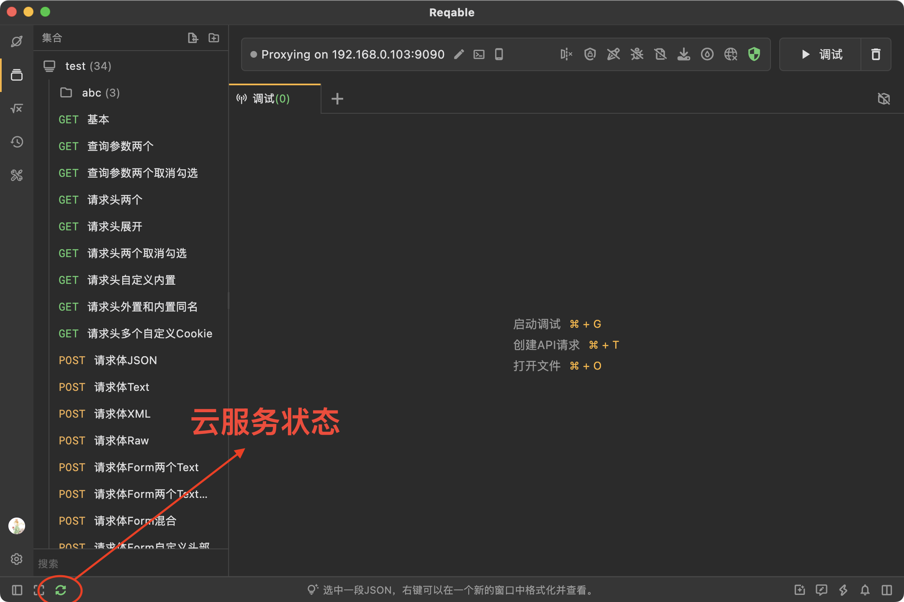
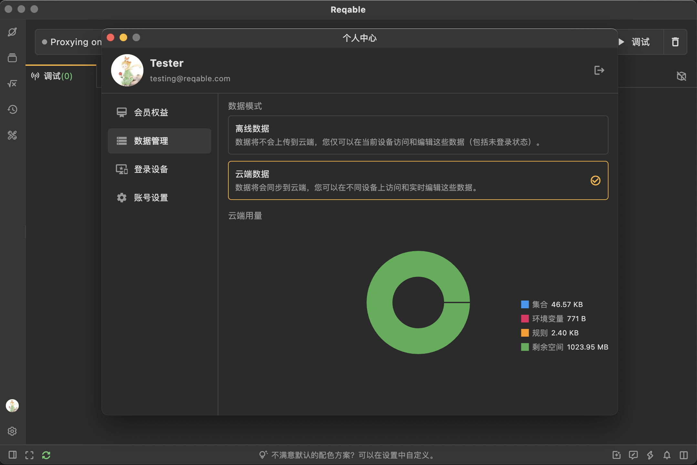
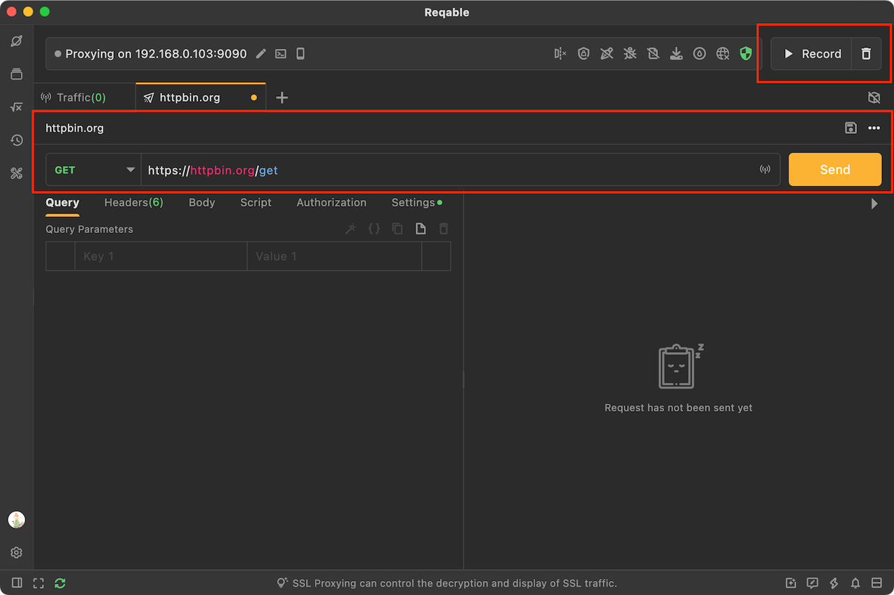
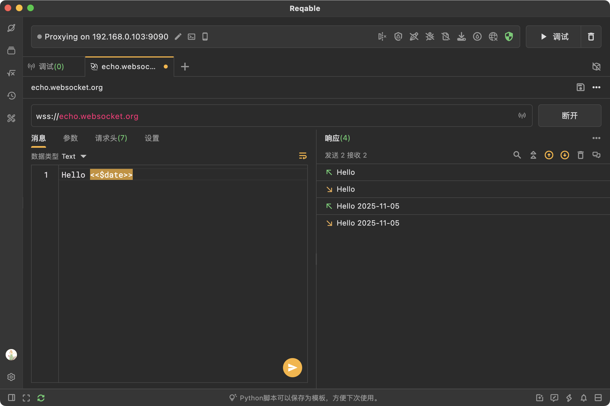
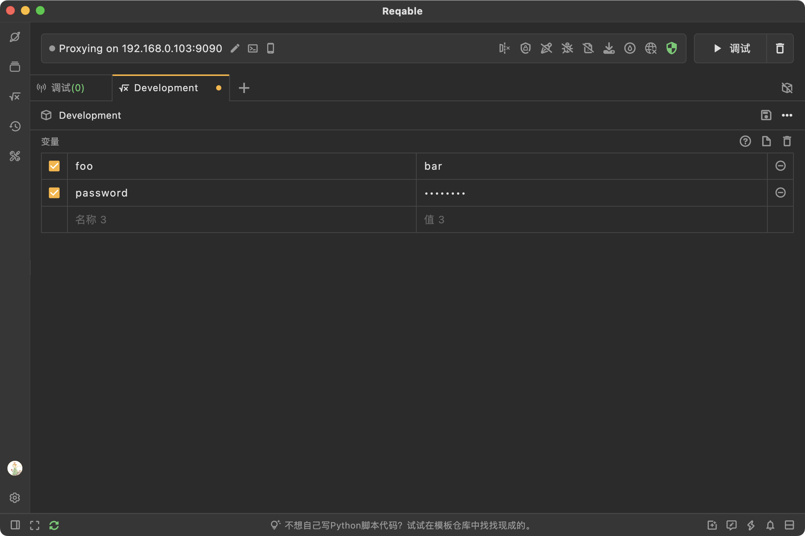
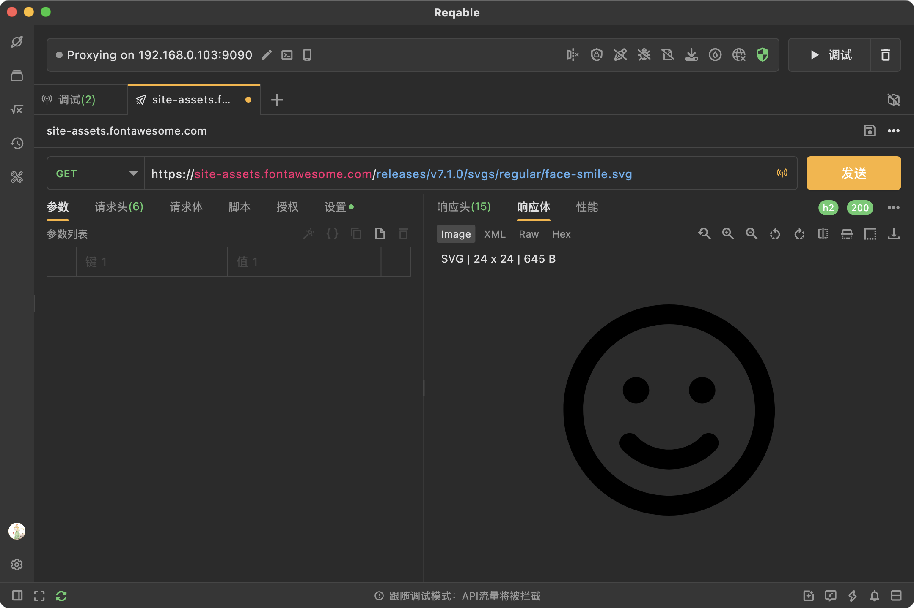

Hello! After four months of development and two months of beta testing, we're excited to officially release Reqable 3.0 today. Here's a rundown of what's new.

### 1. From license keys to membership

Starting with 3.0, Reqable supports cloud data storage and multi‑device sync, so we've rebuilt our membership system. We've moved from license‑key activation to account‑based membership. **Professional Edition users can migrate their entitlements to the new Premium membership at no extra cost, and Community Edition users can register for the free Basic.** From now on, your email and password are your login credentials, and cloud data syncs using your account as the identity.

In the new version, we've removed the platform‑type restriction of the old Professional Edition license. The same account can sign in on different platforms at the same time (no platform limits), with a maximum of six devices per account.

In addition to the standard email/password login, 3.0 supports third‑party sign‑in via GitHub, Google, and Apple (iPhone only).

The account entry is still at the bottom‑left (on mobile, at the top of the sidebar). After signing in, your avatar will show here. If you register via third‑party oauth, we'll automatically fetch your email, nickname, and avatar from that platform. If you register by email & password, we'll generate a random avatar that you can change later in the profile window.

:::warning
Because we've strengthened password hashing in the new version, the License Manager Center credentials no longer work, you'll need to register again.
:::

Click the avatar in the bottom‑left to open your profile, where you can manage your account, data mode, and signed‑in devices.

:::caution
In profile, you can migrate an professional license to the new premium membership. After migration, the license is automatically revoked and can no longer activate older versions. Of course, you can choose not to migrate and keep using older versions. If an email owns multiple licenses, you can transfer them to another email or request a refund for any extras.
:::

### 2. Cloud services and data sync

Cloud services and data synchronization are the core features of 3.0. Your API Collections, Environment Variables, and Debug Rules can be uploaded to our cloud and automatically synced across devices. API Collections and Environments sync in real time—changes are instantly visible on other devices, making real‑time collaboration easy.

In the lower‑left of the window, a cloud connection status icon shows green when connected. If the app can't reach the cloud, you won't be able to modify API Collections and Environments (similar to tools like Postman), but API testing remains unaffected.

:::note
Real‑time sync isn't a bulk upload/download. Each operation is synchronized with the server, and the client must stay fully in sync with the backend. Therefore, you can't modify synced data while offline.
:::

Cloud sync is available to all users, including free users. Paid users get larger cloud storage and multi‑device login/sync. The current free quota is sufficient for the vast majority of users and doesn't burden our costs. If you do hit the ceiling, that's a good sign it's time to consider paying.

If you have privacy concerns or worry about cloud stability, you can switch the data mode to Offline in Profile (Cloud is the default).

Offline data is the same dataset used when you're not signed in. Signing in or out doesn't change your data. In Offline mode, data behaves like in older versions—stored only on the local device and unrecoverable if lost.

:::caution
Cloud and Offline data are stored in different local directories and aren't auto‑imported when switching. After upgrading from 2.x to 3.0, you'll see a one‑time prompt asking whether to import your old offline data to the cloud. If you miss it, you'll need to manually export the offline data and then import it again under the Cloud environment.
:::

When your cloud storage is low or exceeded, we'll notify you in the bottom‑right corner. In the window above, you can also view usage by category for easier management.

### 3. Main UI adjustments

We've made a few notable adjustments to the main UI, especially in the two areas shown below:

First, we've removed the accent color from the Debug toggle and changed its copy. The accent now highlights the Send button in API testing. The rationale: in the API Testing tab, Send is used frequently, while the Debug toggle shouldn't compete for attention. And in the Debug tab, users can easily find the switch at the top‑right, so the accent adds little value. This change may feel unfamiliar at first, but we believe it improves usability.

Second, we've removed the dropdown to the right of Send and moved those options into the upper toolbar. We've also exposed a frequently used Save button. The hierarchy path of the API within its collection is now shown; click a segment to jump to that folder, or click the name to rename the API.

### 4. WebSocket request testing

We've added WebSocket request testing and support saving WS requests into API Collections (marked with a WS badge). For now, intercepting/modifying WebSocket messages in Debug mode isn't supported; we'll roll that out in subsequent 3.x updates.

The WebSocket tab layout is similar to HTTP request testing. It supports sending Text and Binary messages and custom request headers. You can also reference environment variables using `<<>>` in WebSocket messages.

### 5. A new Environment editor

We've rebuilt the Environment editor. It no longer opens as a modal; it's now a first‑class tab in the main UI, managed alongside other REST tabs, as shown below:

Like other REST tabs, you can edit labels and environment names above the variable list and Save or Delete as needed.

### 6. Device filter and cascading conditions

For the traffic list, we've added a Device filter in the sidebar. By default, the name shows the device IP; you can right‑click to set an alias. There's also a Device column in the list (off by default—right‑click the header to enable).

“Cascading conditions” means filters narrow from top to bottom: Bookmarks → Device → App → Domain. For example, after choosing a Device, the App list shows only apps on that device; after choosing an App, the Domain list shows only domains under that app.

### 7. SVG preview

You can now preview SVG images directly rather than only seeing XML text. As with other image types, you can zoom, rotate, and mirror SVGs.

### 8. Optimizations and bug fixes

There are quite a lot, please check the [Changelogs](/docs/changelogs/) for details.

### 9. Roadmap

With 3.0 officially released, we'll resume rapid iteration, about 1–3 releases per week—focusing on fixing and optimizing long‑standing issues, including some performance problems.

In 3.1, we'll redesign several underlying mechanisms and re‑implement rewrite‑related features to address dependencies on origin servers, among other issues.

In 3.2, we plan to support sending gRPC requests and Protobuf parsing.

Finally, thank you for your support!