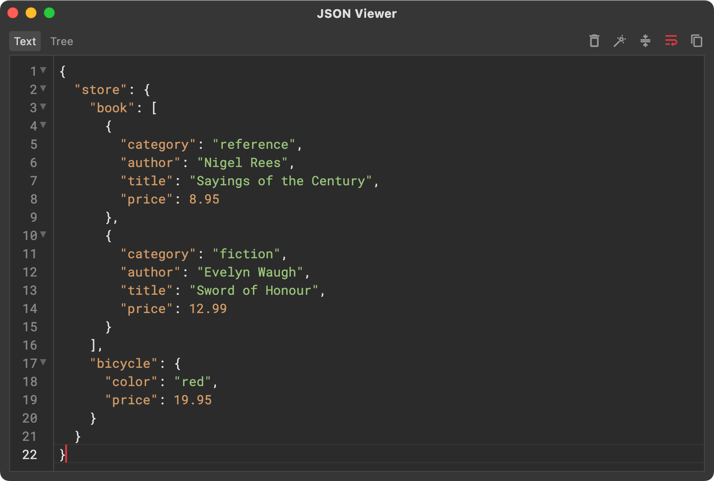
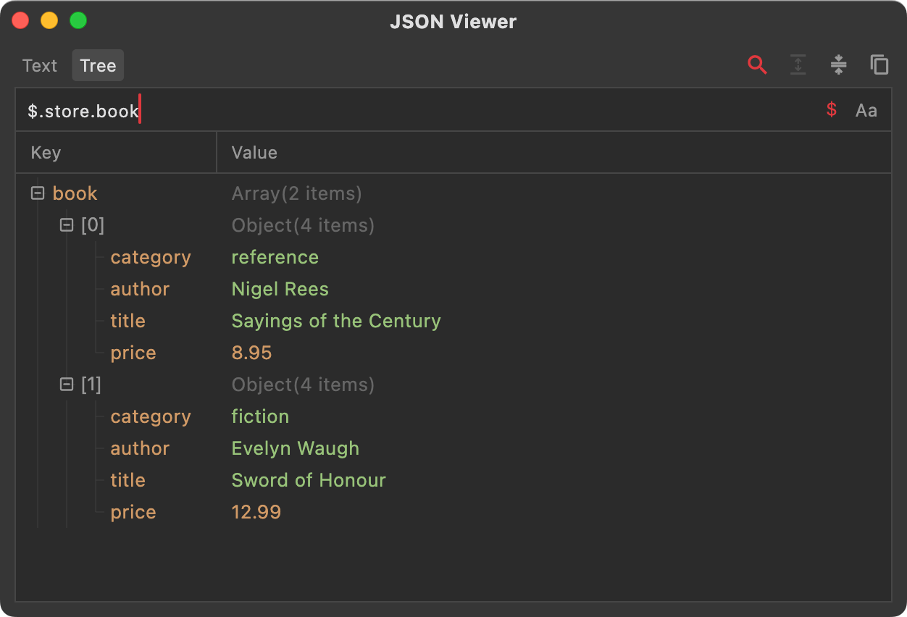
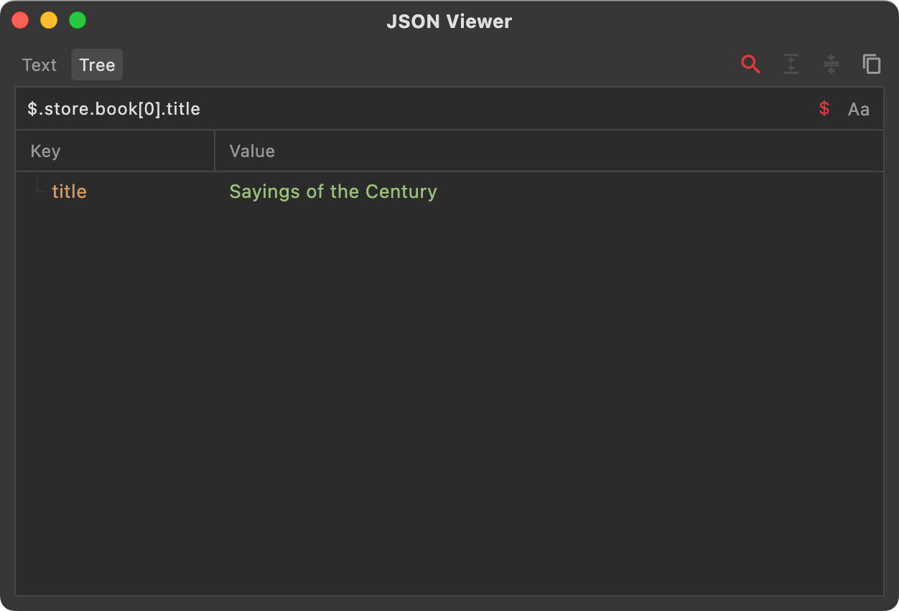
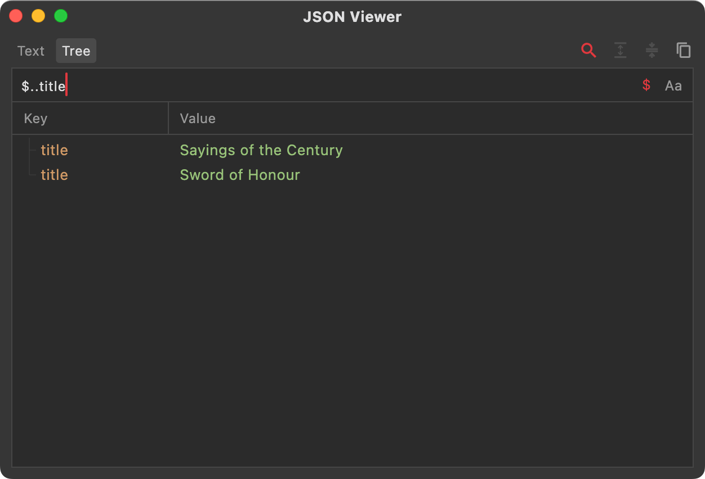
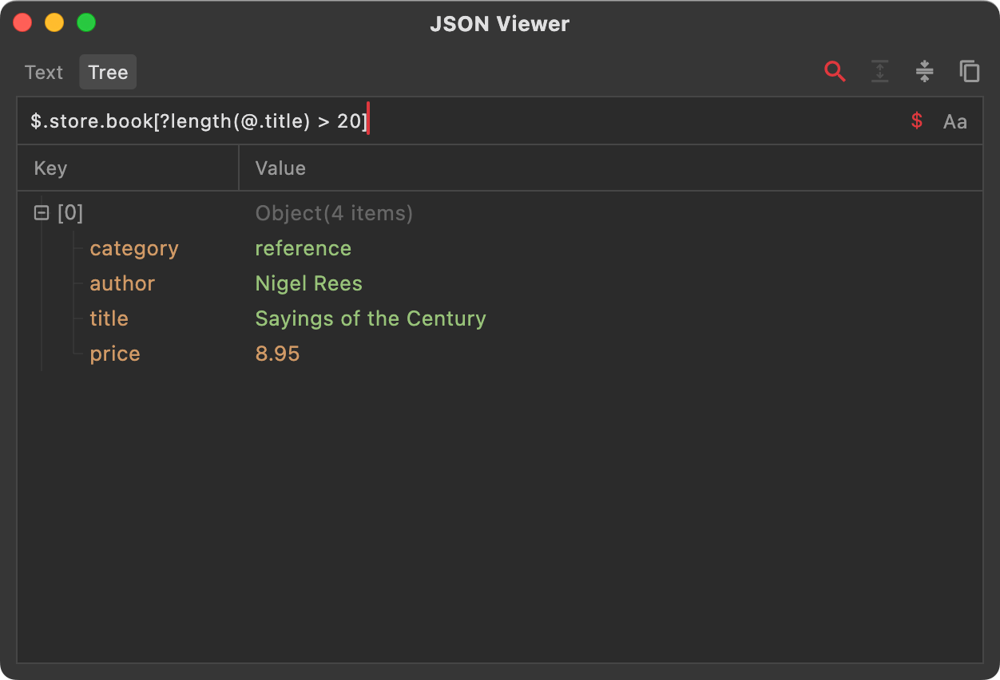
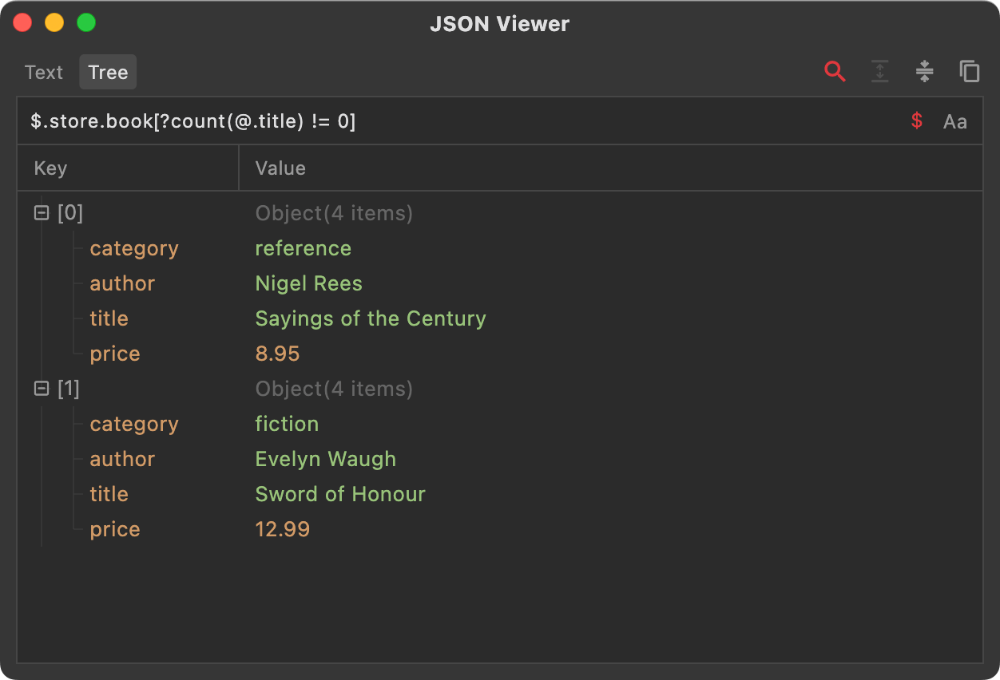
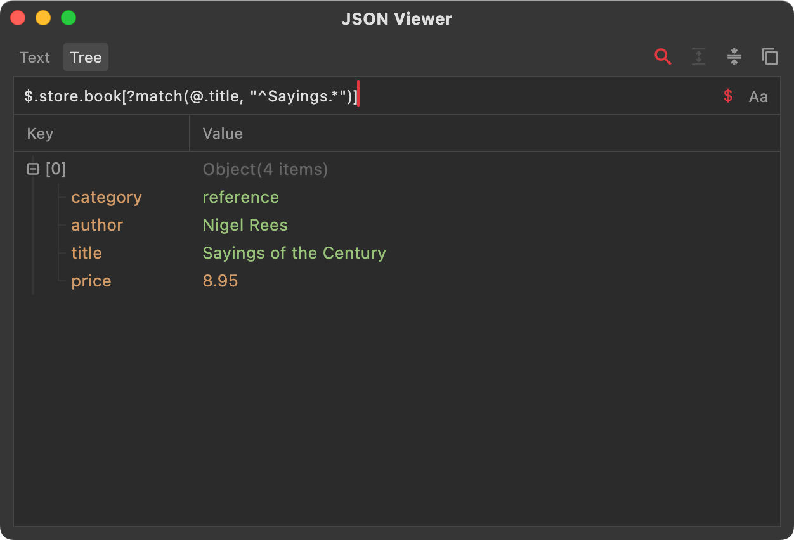
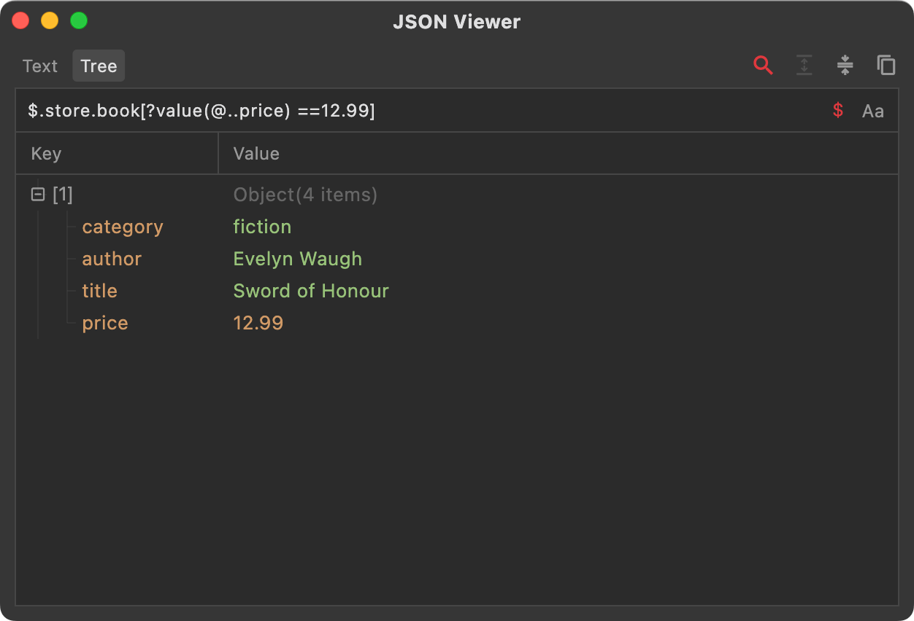

JSON Path is an expression syntax for searching and extracting specific content from JSON data. When JSON structures get complex—deeply nested layers or huge arrays—browsing and locating values becomes inefficient. JSON Path was created as a regex-like syntax to solve this, but it remains much simpler than regular expressions.

<!--truncate-->

# 1. Basic Syntax

Here are the core operators:
- `$` — the root of the JSON document. JSON Path expressions always start with `$` because evaluation begins at the root.
- `.` — accesses a child of the current node and is followed by the key name. For example, `$.data` refers to the `data` node under the root, and `$.data.foo` refers to the `foo` node under `data`.
- `[]` — operates on nodes. Commonly, it accesses array items by index such as `items[0]`; it can also select ranges like `items[0:2]` to get items at indices 0–2. Expressions can appear inside brackets; more on that later.
- `*` — wildcard that matches any key or index. For example, `$.*` retrieves all values under the root; `items[*]` retrieves every element of the `items` array.
- `..` — recursive descent that matches any node. For example, `$..key` gets all nodes whose key is `key` anywhere in the JSON.
- `@` — refers to the current object, often used in nested expressions. For example, `$.key[?(@.foo=0)]` uses `@.foo` to refer to the `foo` node under `key`.

Using the JSON data below, here are some sample expressions (you can find the JSON viewer for these examples in the Reqable toolbox):

`$.store.book` extracts the `book` node (an array) under `store`, as shown below:

`$.store.book[0].title` extracts the `title` of the first item in the `book` array under `store`, as shown below:

`$..title` extracts every `title` node across the entire JSON document, as shown below:

# 2. Array Operations

Object navigation is straightforward: use the dot operator to move to the next node. Arrays, however, have more syntax options. Here are the essentials:

1) Simple index access with `[index]`, e.g., `$.items[0]`.

2) Range selection with `[start:end]`, e.g., `$.items[0:2]` for the first two elements of `items`.

3) Step selection with `[start:end:step]`, e.g., `$.items[0:4:2]` returns elements 0 and 2, skipping 1 and 3 because the step is 2.

4) Negative index with `[-index]` to read from the end. `-1` is the last element, `-2` is the second last, and so on.

# 3. Expressions

For large datasets, use filter expressions with the syntax `[?(expression)]`, where `expression` supports comparison operators (>, <, >=, <=, ==, !=) and logical operators (&&, ||).

Using the same JSON as above:

To extract books whose `price` is greater than 10, use the filter `$.store.book[?(@.price > 10)]`. Here `@.price > 10` is the comparison, with `@` referring to the current `book` object.

# 4. Built-in Functions

For more complex scenarios, expressions alone may not suffice—you may need functions for dynamic calculations or regex matching. Common built-ins include:

`length` — `?length(expression)` returns the length of the value specified by `expression`. Example: `$.store.book[?length(@.title) > 20]` filters books whose `title` length is greater than 20.

`count` — `?count(expression)` returns the length of an array or the number of object properties specified by `expression`. Example: `$.store.book[?count(@.title) != 0]` gets books that contain a `title` property; if missing, the function returns 0.

`match` — `?match(expression, value)` returns data whose `expression` matches `value`. `value` must be a string and supports regex. Example: `$.store.book[?match(@.title, "^Sayings.*")]` gets books whose `title` starts with "Sayings".

`search` — `?search(expression, value)` returns data whose `expression` contains `value` (a substring). `value` must be a string and supports regex. Example: `$.store.book[?search(@.title, "the")]` gets books whose `title` contains "the".

`value` — `?value(expression)` converts the node(s) specified by `expression` into a value. If `expression` resolves to a single node, it returns that value. If multiple nodes are returned, conversion fails and yields empty. Example: `$.store.book[?value(@..price) ==12.99]` fetches books priced at 12.99. Note that `@..price` produces a list, not a scalar. If the list has exactly one element, `value` returns that element; if it has zero or more than one, conversion fails and yields empty.

