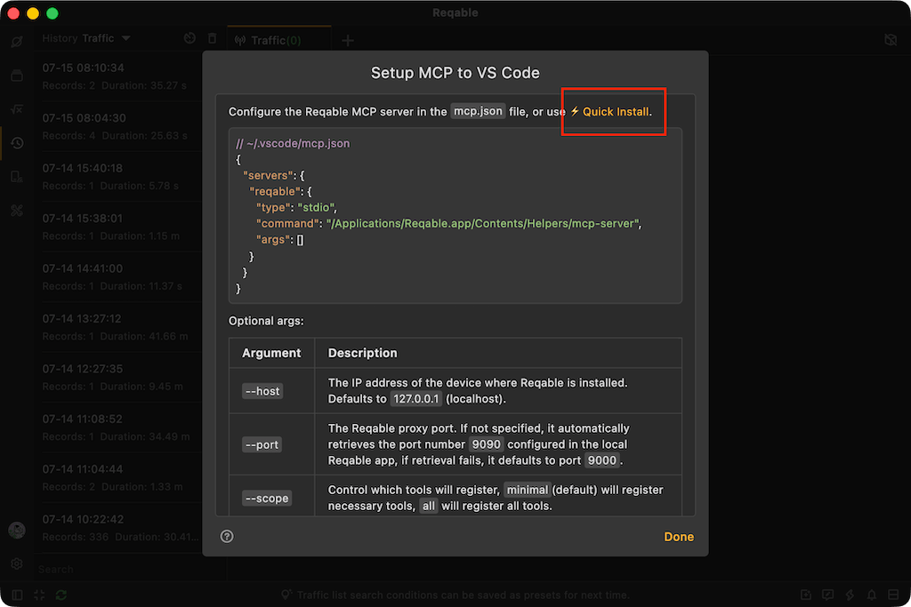
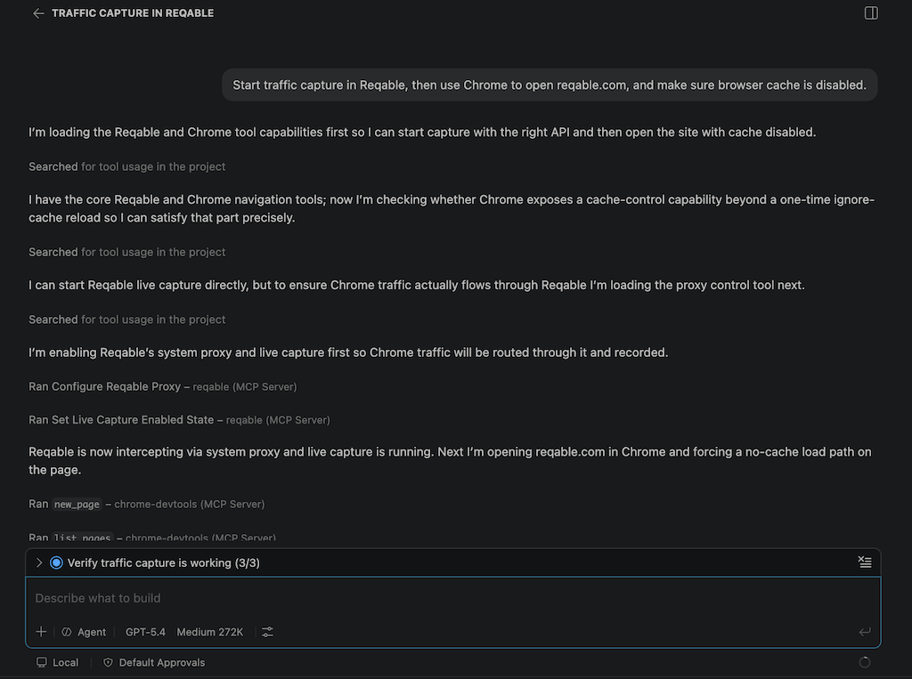
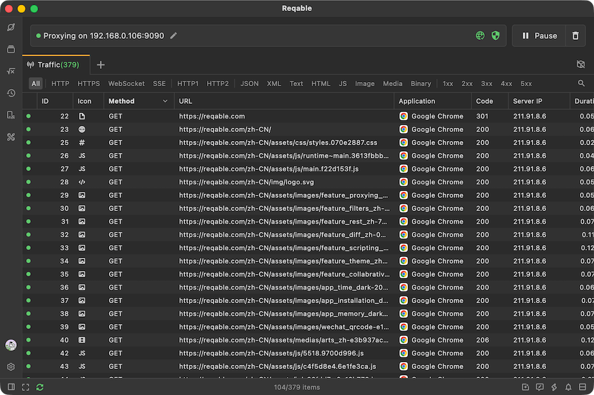
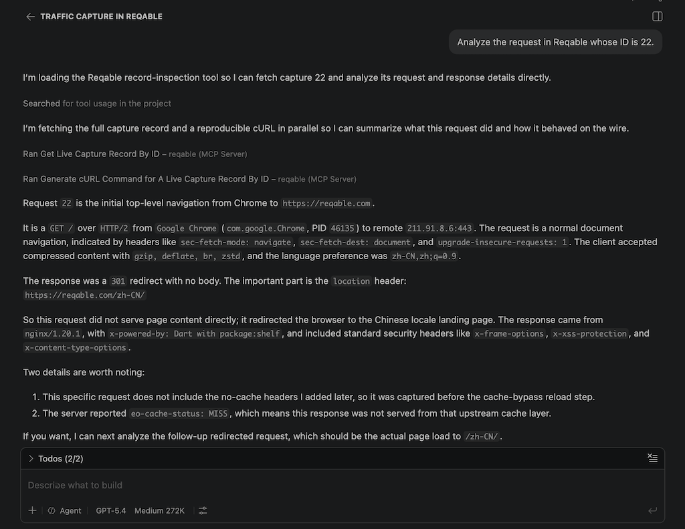
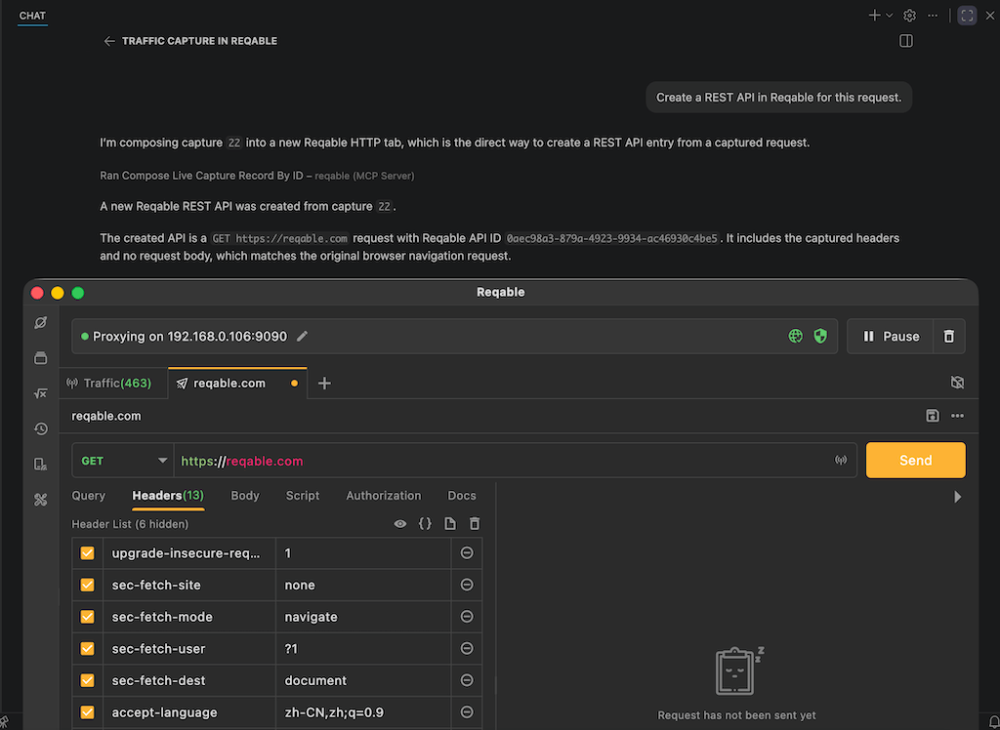
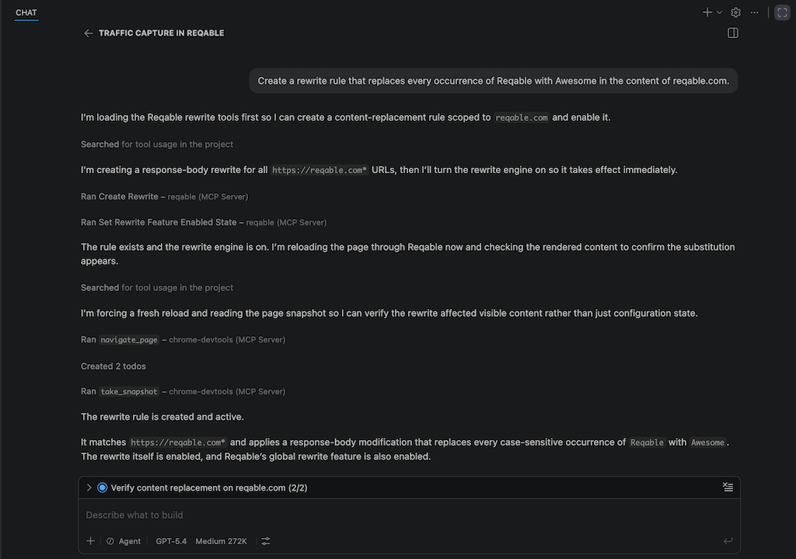
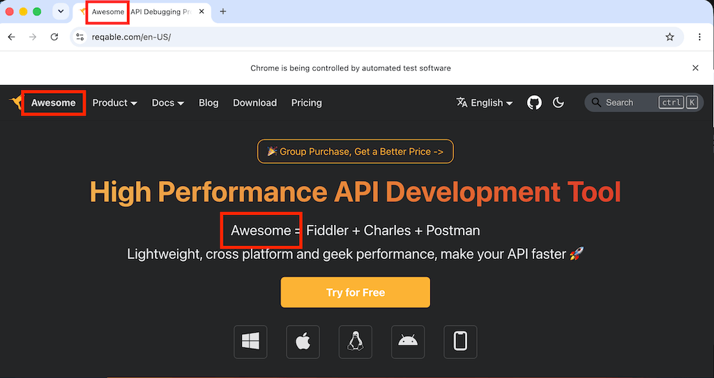
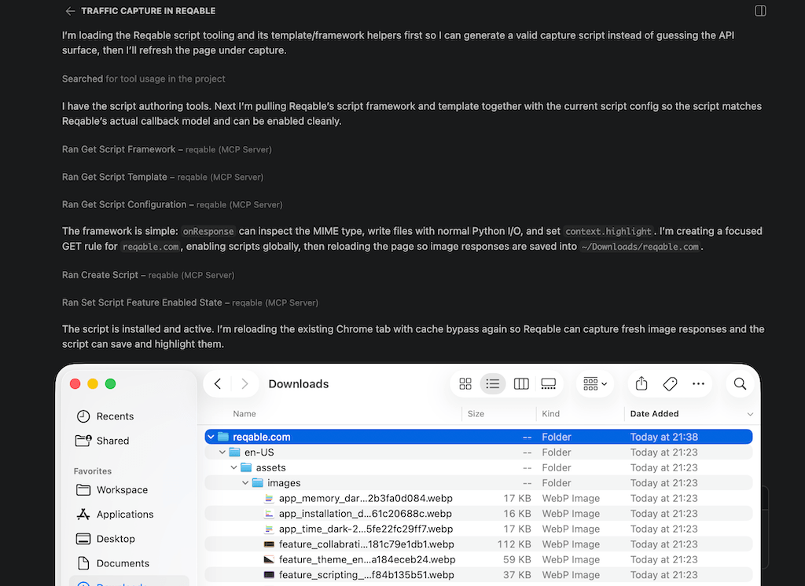
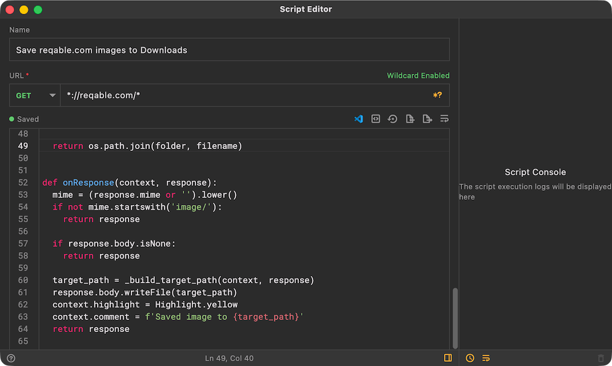
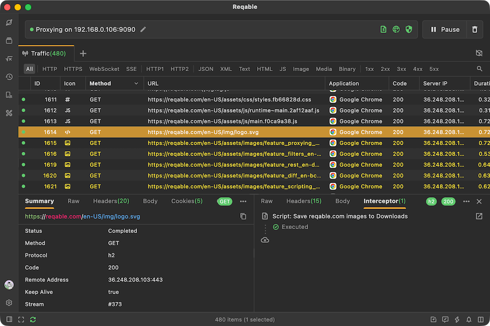

Reqable, one of the leading developer tools, introduced MCP support in version 3.2, making it possible to connect Reqable with AI. As a result, API debugging becomes much more efficient. In this article, we will look at how AI can take over much of the API debugging workflow.

<!--truncate-->

# 1. Tool Preparation

Any AI agent that supports MCP server configuration will work, including Codex, Claude Code, Cursor, Copilot, and Windsurf. In this demo, we will use the built-in GitHub Copilot in VS Code with the `GPT-5.4` model selected. In practice, the choice of agent or model does not matter much for this workflow. The task only requires a small amount of code generation, so most mainstream options are more than capable.

Next, download and install the latest [Reqable](https://reqable.com) v3.2.7. After the initial setup, complete the certificate installation with one click, then configure the Reqable MCP server in VS Code. Reqable already includes MCP setup guides for different AI agents. Open the application menu `Tools` -> `MCP` -> `VS Code`, then click `Quick Install` to launch VS Code and install it automatically.



Click `Install` in VS Code to configure the MCP server. Once the installation finishes, press `Ctrl + Shift + P`, search for `MCP`, and run `MCP: List Servers` to confirm that the server is in the `Running` state.


[Reqable MCP](https://github.com/reqable/reqable-mcp-server), which is already open source on GitHub, provides more than a hundred tools for AI-driven control. By default, it registers only the most commonly used ones. During MCP configuration, you can enable the full toolset with the `--scope all` argument.

One thing to keep in mind is that too many tools can bloat the context. Even if all tools are registered, many AI agents still will not load all of them unless explicitly instructed to do so. In this example, we will stick with the default configuration and load only the tools we actually need.

To let AI control Chrome as well, we also install `Chrome DevTools MCP`. The full `mcp.json` configuration is shown below:

```json
{
	"servers": {
		"chrome-devtools": {
			"command": "npx",
			"args": [
				"-y",
				"chrome-devtools-mcp@latest"
			],
			"type": "stdio"
		},
		"reqable": {
			"type": "stdio",
			"command": "/Applications/Reqable.app/Contents/Helpers/mcp-server",
			"args": []
		}
	}
}
```

At this point, both Reqable and Chrome are ready to be controlled by AI.

# 2. Automated Traffic Capture

We can start with the simplest instruction:

```
Start traffic capture in Reqable, then use Chrome to open reqable.com, and make sure browser cache is disabled.
```



AI will automatically control Reqable to configure the system proxy and start capturing traffic, while also launching Chrome to open `reqable.com` with browser cache disabled. After the page finishes loading, it will check whether Reqable has captured the page requests. You can also switch to the Reqable window and verify the result yourself.



You can then ask AI to analyze a specific request inside Reqable. It can identify the request by ID, by URL, or even by filter conditions, such as requests containing the keyword `Hello World`.

```
Analyze the request in Reqable whose ID is 22.
```



Beyond request analysis, AI can also create API tests inside Reqable, generate cURL commands, add requests to a specified API collection, and more. That makes follow-up investigation much easier for developers and testers.

```
Create a REST API in Reqable for this request.
```



If needed, you can continue by running API tests directly in Reqable, without manually editing or importing API at all.

# 3. API Debugging

Now let us look at a few more advanced features, such as rewrites and scripts. During development and testing, it is common to modify data such as location coordinates or order amounts. In a traditional workflow, you would open a traffic capture tool, write modification rules manually, and then test again. In the AI era, much of that manual work can be skipped.

We will continue from the same session and let AI handle a simple simulated scenario:

```
Create a rewrite rule that replaces every occurrence of Reqable with Awesome in the content of reqable.com.
```



As you can see, AI automatically completed the following steps end to end:

- Created a rewrite rule in Reqable to replace `Reqable` with `Awesome`.
- Enabled both the global rewrite switch and the newly created rule in Reqable.
- Refreshed the web page and checked whether the change had taken effect.



Switching back to the browser confirms that the page text has been changed successfully.

In addition to controlling rewrites, AI can also manage request breakpoints and write scripts to process requests. Below is an example of automatic script generation using the following instruction:

```
Write a Reqable script and refresh the page, the script purpose:
- Save all image resources from reqable.com into the current user's Downloads directory, using the domain name as the folder name.
- Highlight the matched records in Reqable.
```



No manual work is required. The images are saved successfully, with the original path structure preserved. You can also open the script in Reqable to take a quick look at the generated code.



It is just a small Python script, but writing it by hand would still take time. AI handled it in one shot.

```python
context.highlight = Highlight.yellow
context.comment = f'Saved image to {target_path}'
```

You can find the highlighted records directly in Reqable.



Among thousands of requests, the yellow highlights make the relevant ones easy to find, and the comment shows the full saved file path for each request.

# 4. Thoughts

In the AI era, a great deal of purely manual work will gradually be replaced by AI. That applies not only to programming, but also to many testing tasks. As the saying goes, to do a good job, you must first sharpen your tools.

👉 https://reqable.com
