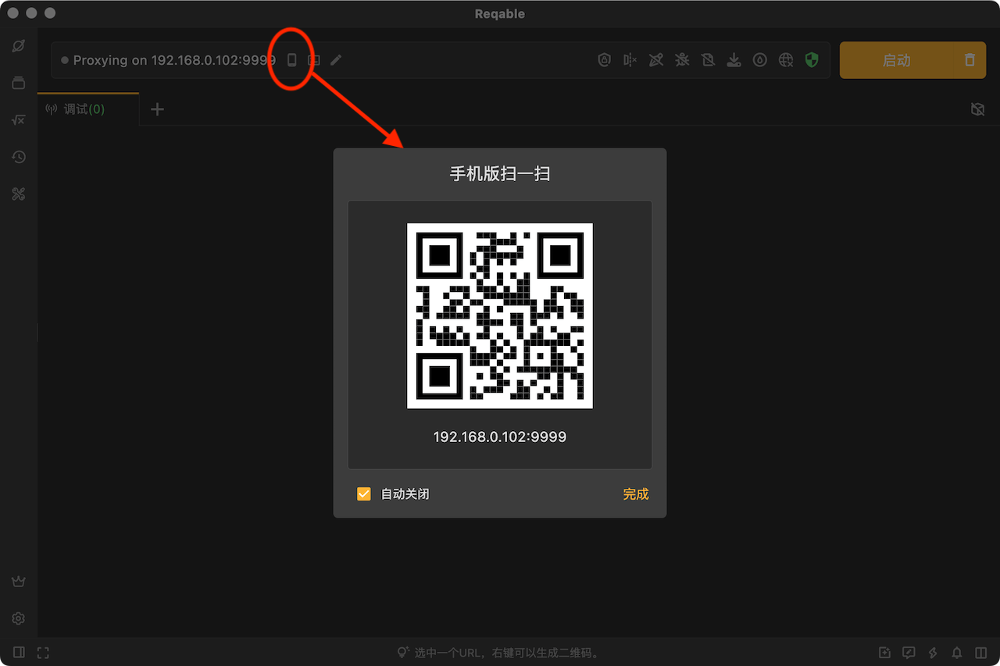
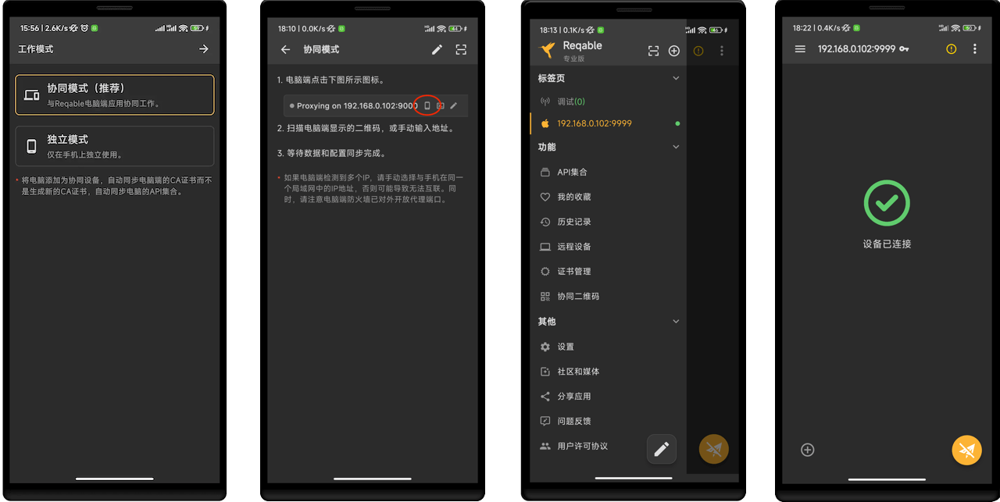
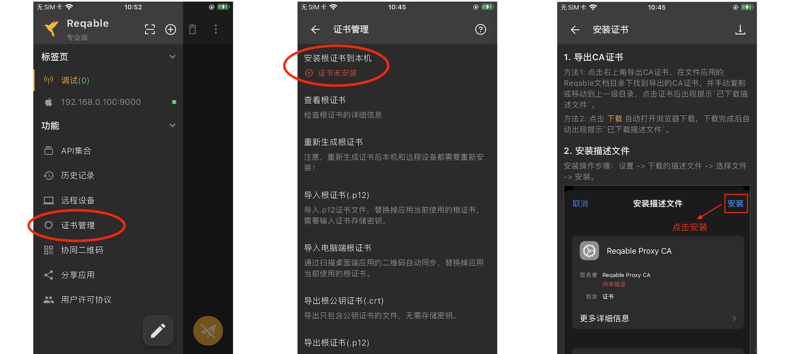
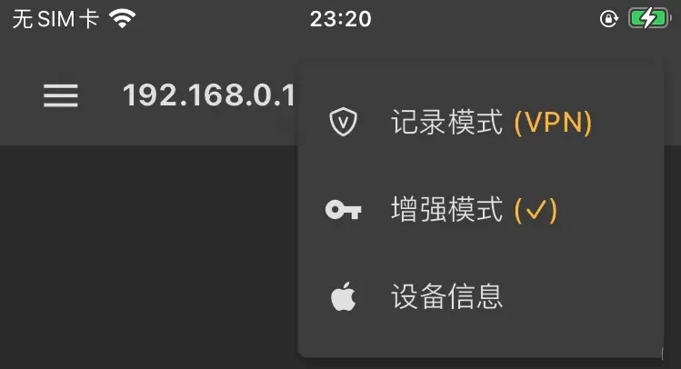
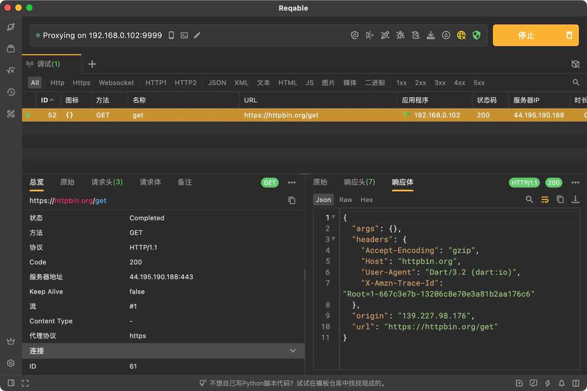
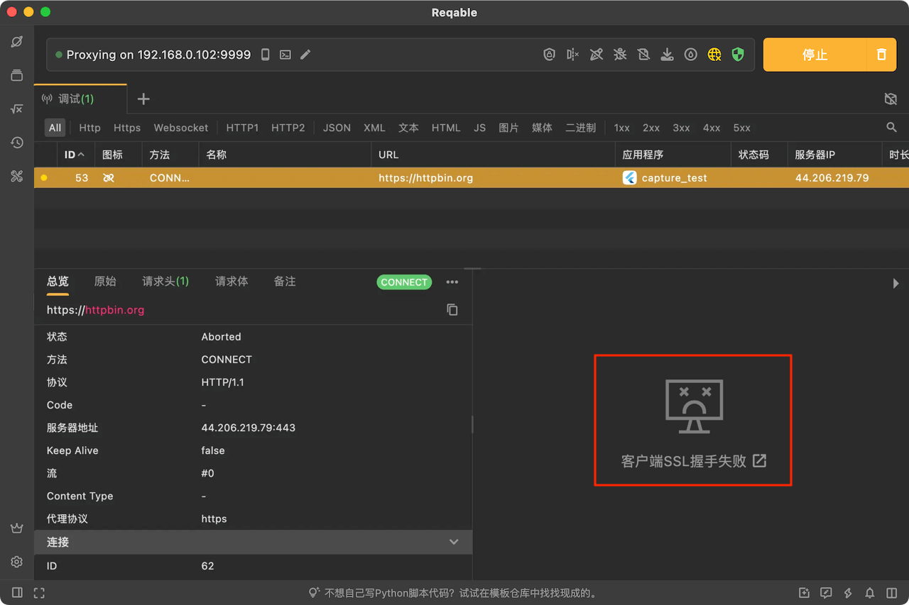

Flutter应用网络请求调试一直是业内难题，原因在于Dart语言标准库的网络请求不会走Wi-Fi代理，常规通过配置Wi-Fi代理来抓包的方式行不通。这给我们日常开发测试造成了很大的阻碍，严重降低工作效率。因此写一篇教程，讲解如何使用Reqable对Flutter移动应用进行抓包调试。

<!--truncate-->

# 1. 环境准备
- 电脑：Windows/Mac/Linux机器，安装Reqable客户端（建议2.18.0以上版本）。
- 手机：Android/iOS设备，安装Reqable移动端App（要求最低2.19.0版本）。

# 2. 安装证书

首先，启动Reqable电脑客户端，完成初始化进入主界面。点击顶部手机图标，打开二维码。



接下来，手机连接到和电脑所在的同一个Wi-Fi局域网。打开Reqable手机App，选择协同模式，扫描上面电脑端二维码进行连接。



连接成功后，开始下一步，安装证书。由于是对手机抓包，需要在手机安装证书，而不是在电脑安装证书，所以电脑上的证书可以选择不安装。

Reqable在上面选择协同模式初始化的时候，已经自动将电脑的根证书同步到了手机，安装证书只需要在手机上操作即可，无需将证书手动从电脑拷贝传输到手机。**注意：手机抓包，必须安装电脑证书到手机。如果App是以独立模式初始化，App会生成和电脑不同的根证书，扫码连接电脑后需要手动同步根证书到手机再安装。**

### Android设备

注意，Flutter应用程序只信任Android系统目录的证书，不会信任用户证书。Native应用我们可以通过配置 network_security_config.xml 文件或者降低targetSdkVersion到23来让应用信任用户证书，但是这个对于Flutter应用是不行的。

因为Dart SDK中已经强行写死了只信任系统目录下的证书。这个逻辑定义在 runtime/bin/security_context_linux.cc 中，有兴趣可以去翻看源码。

```c++
// On Android, we don't compile in the trusted root certiicates. Instead,
// we use the directory of trusted certificates already present on the
// device. This saves ~240KB from the size of the binary. This has the
// drawback that SSL_do_handshake will synchronously hit the filesystem
// looking for root certs during its trust evaluation. We call
// SSL_do_handshake directly from the Dart thread so that Dart code can be
// invoked from the "bad certificate" callback called by SSL_do_handshake.
const char* android_cacerts = "/system/etc/security/cacerts";
LoadRootCertCache(android_cacerts);
```

Android设备上要安装证书到系统目录，目前只有两种方式：

方式一：Root设备，USB连接到电脑，Reqable可以通过ADB一键安装。


方式二：设备刷Magisk环境，从Reqable下载证书模块，安装即可。

Magisk模块既可以从电脑端下载（见上图Magisk），也可以从手机端`证书管理` -> `安装根证书到本机` -> `Magisk模块`保存。

根证书安装成功后，Reqable手机App会有证书已安装的提示。如果已经安装，但仍然提示证书未安装，可能是操作出错，请复查安装步骤。

### iOS设备

iOS安装证书要简单很多，标准三个步骤。

- 下载描述文件。可以从Reqable手机App直接保存，也可以启动浏览器下载描述文件。
- 设置 -> 下载的描述文件 -> 选择文件 -> 安装。
- 设置 -> 通用 -> 关于 -> 证书信任设置 -> 打开开关。



可以看到iOS设备安装证书要简单很多，所以我们一般推荐使用iOS设备调试。

更多有关证书安装的说明，可以查阅Reqable[官网文档](https://reqable.com/zh-CN/docs/getting-started/installation/)。

# 3. 增强模式

在手机App上，Reqable提供了两种网络流量捕获模式，一种是**常规模式**，一种是**增强模式**。这里先简单介绍下两种模式的区别。

常规模式，和配置Wi-Fi代理效果一样，但是不需要用户去手动配置Wi-Fi代理。可以对绝大多数应用的流量分析，包括浏览器等。

增强模式，强制捕获所有的流量，包括不走Wi-Fi代理的网络请求流量，例如我们需要解决的Flutter应用。在Android设备上，增强模式还可以获取到流量来源的应用信息。

默认情况下，Android是自动开启增强模式的，用户无需手动开启。iOS设备有些特殊，手机在非协同模式下无法开启增强模式，必须连接协同设备（电脑），并在标题菜单中手动开启。



对于Flutter应用，请一定要开启增强模式。增强模式开启后，标题后面会出现一个钥匙🔑标记。

# 4. 实战演示

首先，创建一个Flutter空项目，这个项目我们简单改改代码作为测试应用。

```
flutter create capture_test
```

加点代码，比如点击  **+** 按钮，发送一次HTTP请求。
```dart
void _incrementCounter() async {
  final HttpClient httpClient = HttpClient();
  final HttpClientRequest request = await httpClient.getUrl(Uri.parse('https://httpbin.org/get'));
  request.close();
}
```
通过下面的命令，启动Flutter应用。
```
flutter run -d 设备ID
```
接下来，我们开始测试。Reqable手机App中开启调试，电脑端同时会进入调试状态，如果电脑没有自动开启调试，那么手动启动一下。

正常情况下，应该能成功抓到HTTP请求了，如下图。



如果出现下图这种**客户端SSL握手失败**的提示，说明是手机上证书没有安装成功。



这种情况，在命令行控制台中也能看到Flutter的报错。

```
E/flutter (24436): [ERROR:flutter/runtime/dart_vm_initializer.cc(41)] Unhandled Exception: HandshakeException: Handshake error in client (OS Error:
E/flutter (24436):   CERTIFICATE_VERIFY_FAILED: unable to get local issuer certificate(handshake.cc:393))
E/flutter (24436): #0      _SecureFilterImpl._handshake (dart:io-patch/secure_socket_patch.dart:99:46)
E/flutter (24436): #1      _SecureFilterImpl.handshake (dart:io-patch/secure_socket_patch.dart:143:25)
E/flutter (24436): #2      _RawSecureSocket._secureHandshake (dart:io/secure_socket.dart:920:54)
E/flutter (24436): #3      _RawSecureSocket._tryFilter (dart:io/secure_socket.dart:1049:19)
E/flutter (24436): <asynchronous suspension>
```
**Q：只有Android设备，且无法将证书安装到系统证书目录，那么该怎么办？**

修改代码强行信任任意证书，通过这个还可以跳过前面证书安装那一步，真正的无门槛，但就是不安全。所以请注意：***应用正式发行版本务必删除或者绕过此项设置***。
```dart
httpClient.badCertificateCallback = (X509Certificate cert, String host, int port) => true;
```
**Q：只想用电脑，不想用Reqable手机App协同，怎么办？**

同样要修改代码，配置网络请求必须走代理：
```dart
httpClient.findProxy = (url) {
  return 'PROXY 电脑IP:电脑抓包端口';
};
```

好了，本篇教程到这里基本就结束了。