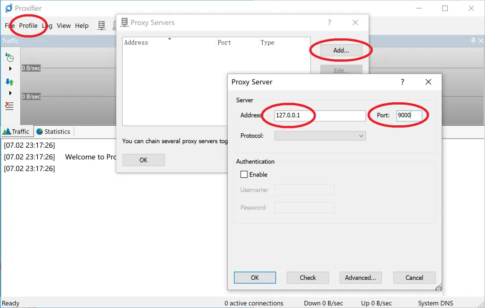
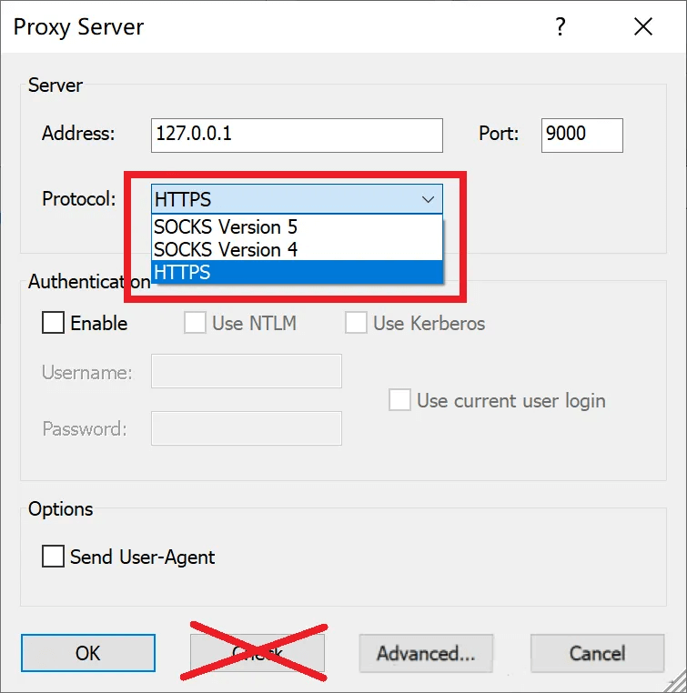
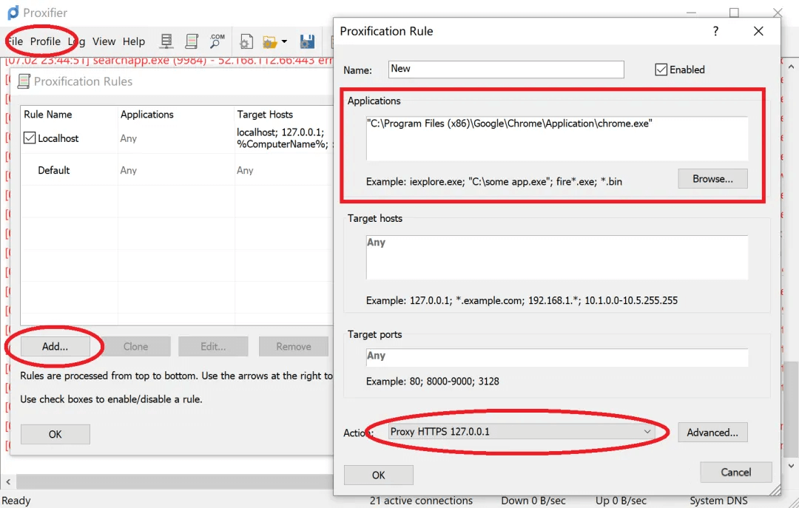
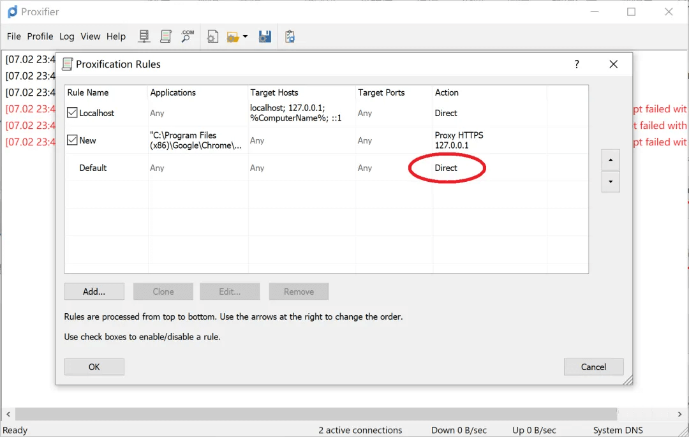
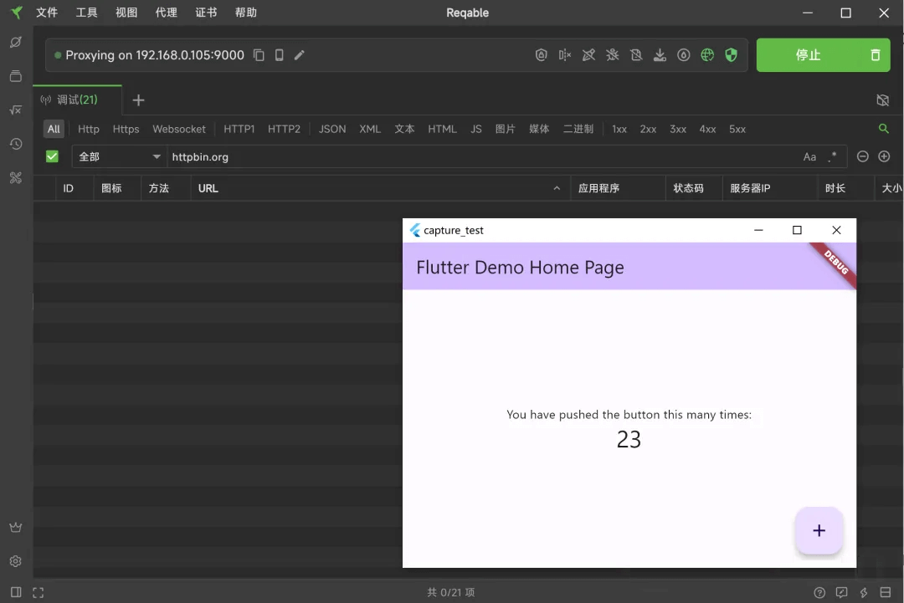
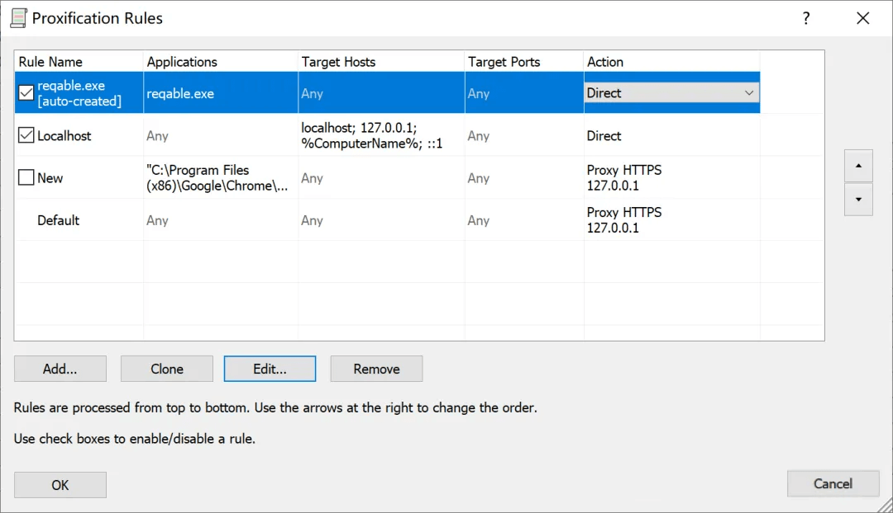
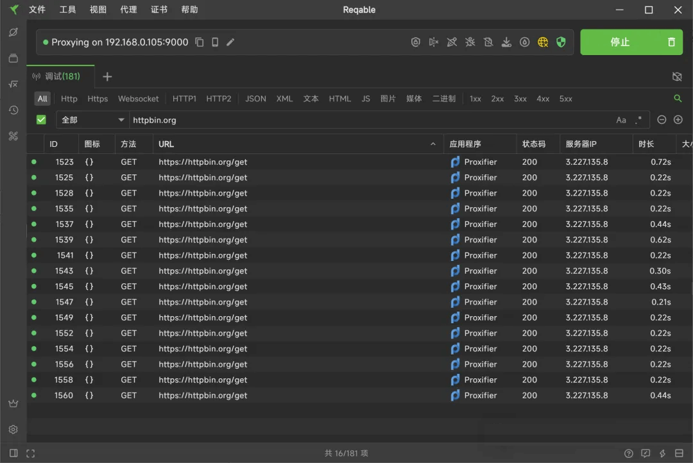

Reqable桌面端借助系统网络代理进行抓包，但是具有很大的局限性。例如，很多应用程序或者网络框架无视系统网络代理设置，流量不经过Reqable。针对这种情况，就需要请Proxifier出场了，本篇文章具体介绍下如何使用Proxifier和Reqable来解决这个问题。

<!--truncate-->

### 原理

为了大家更好地理解本篇文章，我先简单讲一下Reqable桌面端工作的原理。Reqable核心原理是使用MITM（Man-in-the-Middle）技术，启动了一个本地代理服务器（监听0.0.0.0，默认端口9000）来接收网络请求。别的应用程序是不知道这个代理服务器地址的，所以需要将127.0.0.1:9000这个代理地址配置到系统设置网络代理中，别的应用程序就可以获取到了。

客户端（例如浏览器）发送网络请求时，主动连接这个代理服务器发送请求，这样一来Reqable就可以获取到客户端的流量了。缺陷也很明显，会不会读取系统的网络代理配置并连接完全要看客户端的实现，Reqable是处于被动等待连接状态的。例如，Flutter开发的应用程序默认是不会读取系统网络代理的，当然还有很多其他的应用程序也是如此。

这给我们平时开发调试带来很多不便，虽然可以通过修改代码来指定代理服务器发送请求，但是对于发行版本测试就没办法了。另外，一些恶意程序也会主动绕过系统代理设置，隐藏流量，给安全人员对流量进行分析也带来很多麻烦。

借助Proxifier我们可以强行指定应用程序的流量连接到Reqable的代理服务器。这个原理和Reqable移动端的协同模式大同小异。

### Proxifier

首先，[Proxifier](https://www.proxifier.com)是收费应用，有31天的试用期，定价39.95刀。Proxifier支持三个平台，分别是Windows，Mac和Android。下面的演示我们选用Proxifier Windows版本。

Proxifier安装后直接启动，如果窗口没显示，可以从系统托盘中打开。Proxifier无法直接使用，需要做一些配置。

打开 Profile -> Proxy Servers -> Add，配置Reqable的代理服务器。Reqable和Proxifier如果在同一台设备环境上，Address填写127.0.0.1就行了，Port填写Reqable的代理端口，端口在Reqable应用的顶部可以看到。如果Reqable和Proxifier不在同一台设备环境上，Address填写Reqable所在设备的IP地址，IP地址在Reqable应用的顶部也可以看到。



接下来选择代理协议，Proxifier提供了三种协议，分别是HTTPS，SOCKS4和SOCKS5。这三种协议Reqable都支持😀，随便选一个即可，一般来说推荐HTTPS，简单不容易出错。



最后，点击OK就可以了。请注意，不要点Check按钮，结果大概率是失败，因为Proxifier会请求google.com来验证代理配置是否连通，由于某众所周知的原因，是连通不了的。一路点击确认即可，Proxifier基本的配置就完成了。

默认情况下，Proxifier会作用于所有进程，如果希望只指定某一个进程进行代理，按照下面的操作进行。

打开 Profile -> Proxification Rules -> Add，在Applications中配置应用程序的可执行文件路径，可以配置多个，英文逗号隔开。然后，在Action中配置上一步已经配置好的代理选项。



完成这一步后，还需要将Default规则修改成Direct，表示放行其他的流量不进行代理。



Proxifier这边的配置差不多结束了，其他更高级的配置大家查看官网文档和自行尝试，本篇文章就不一一介绍了。

### 实战演示

我们用Flutter Windows项目来演示，因为Flutter应用程序默认是不使用系统代理的。

```shell
flutter create capture_test
```

加点代码，比如点击 + 按钮，发送一次HTTP请求。

```dart
void _incrementCounter() async {
  final HttpClient httpClient = HttpClient();
  final HttpClientRequest request = await httpClient.getUrl(Uri.parse('https://httpbin.org/get'));
  request.close();
}
```

通过下面的命令，启动Flutter应用。

```shell
flutter run -d windows
```

Reqable桌面端点击开始进入调试状态，并配置系统代理。在Flutter应用中无论你点击多少次 + 按钮，Reqable中都收不到任何httpbin.org的流量。



这时候该Proxifier登场了。如果你在前面没有给Proxifier配置指定进程代理的话，只要打开Proxifier就可以了。当然，你也可以给指定进程单独配置。

我们再次在Flutter应用中点击 + 按钮，Proxifier会跳出来一个弹窗，询问为了避免回路是否允许Reqable.exe直连。请一定要点击确认，如果不点击确认的话，网络请求会出现一个循环回路。Proxifier将流量转发给Reqable，又拦截了Reqable的出口流量，再转发给Reqable，这就是一个永不停止的流量回路。点击确认的话，Proxifier会自动给Reqable创建一个直连规则。



不出意外的话，Reqable中便可以看到httpbin.org的数据包了。由于流量是从Proxifier转发过来的，应用程序一栏显示的也是Proxifier。



:::info
在使用Proxifier的时候，Reqable没必要再配置系统代理，这样可以减少不必要的流量进入。
:::