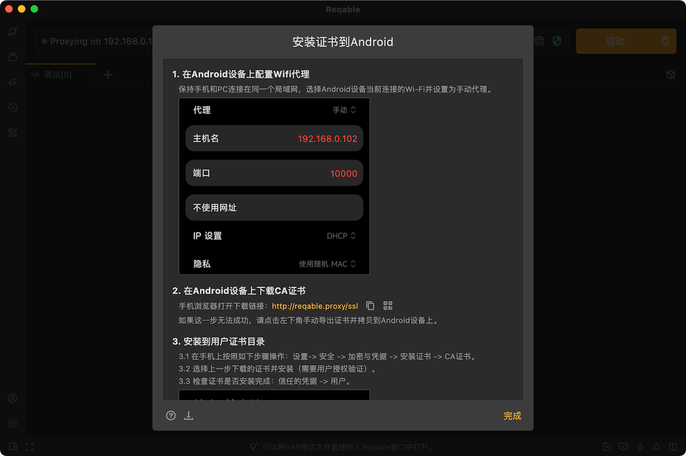
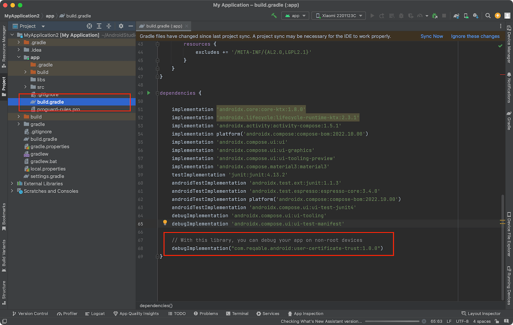
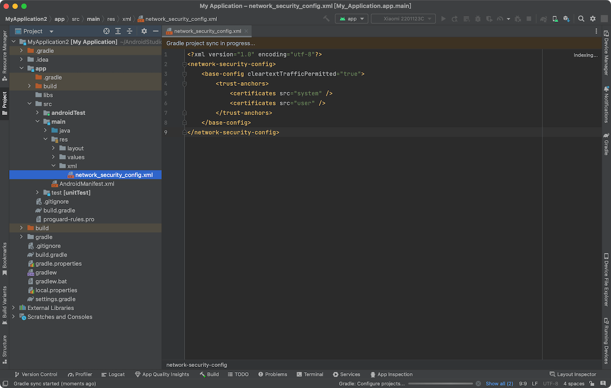

对于非Root的Android设备，CA证书只能安装到用户目录，但是在Android 7.0之后，客户端无法信任用户目录下的CA证书，出现SSL握手失败问题。那么，如何解决呢？

<!--truncate-->

:::caution
前提条件：

- 要求具备目标调试App的源码修改权限。
- 本方案对Android原生App有效，对Flutter开发的App无效。

如果不符合上面的条件，应跳过本篇文章，查看[Root设备的解决方案](https://reqable.com/en-US/docs/getting-started/installation/#android)。
:::

### 安装CA证书到用户目录

Reqable提供了非常详细的用户目录CA证书安装过程，你可以选择通过电脑端Reqable或者手机端Reqable下载CA证书，并通过指示完成CA证书的安装。

如果是使用电脑端的Reqable，最主要的一步是将Android设备连接到和电脑设备的同一个局域网中，并在Android设备上设置Wi-Fi代理。这样才能够在Android设备上打开浏览器下载CA证书。如果无法完成这一步，可以考虑在电脑端Reqable保存证书文件，然后使用ADB工具推送证书文件到手机。



如果是使用手机端的Reqable，在初始化Reqable时选择协同模式并扫码连接电脑端的Reqable，然后直接在手机端的Reqable中保存CA证书文件即可。

接下来，就是在手机上将上面保存的CA证书文件，安装到用户证书目录，操作步骤是：设置-> 安全 -> 加密与凭据 -> 安装证书 -> CA证书。

### 配置网络安全文件

下面这一步是最最最重要的，必不可少，不然上面安装证书就白干了。

使用Android Studio打开目标调试App的源码项目，并打开app目录下面的`build.gradle`或者`build.gradle.kts`文件。

在dependencies中配置一行：

```grovvy
debugImplementation("com.reqable.android:user-certificate-trust:1.0.0")
```



重新编译，打出来的Debug包就可以正常抓包调试了。如果想调试Release包，把上面`debug`去掉或者改成`release`即可。

如果你是内网或者无法访问maven中央仓库，可以按照下面的方式手动配置：

第一步：新建文件 res/xml/network_security_config.xml

```xml
<?xml version="1.0" encoding="utf-8"?>
<network-security-config>
  <base-config cleartextTrafficPermitted="true">
    <trust-anchors>
      <certificates src="system" />
      <certificates src="user" />
    </trust-anchors>
  </base-config>
</network-security-config>
```

第二步：配置到 AndroidManifest.xml

```xml
<?xml version="1.0" encoding="utf-8"?>
<manifest>
  <application android:networkSecurityConfig="@xml/network_security_config">
    ...
  </application>
</manifest>
```
