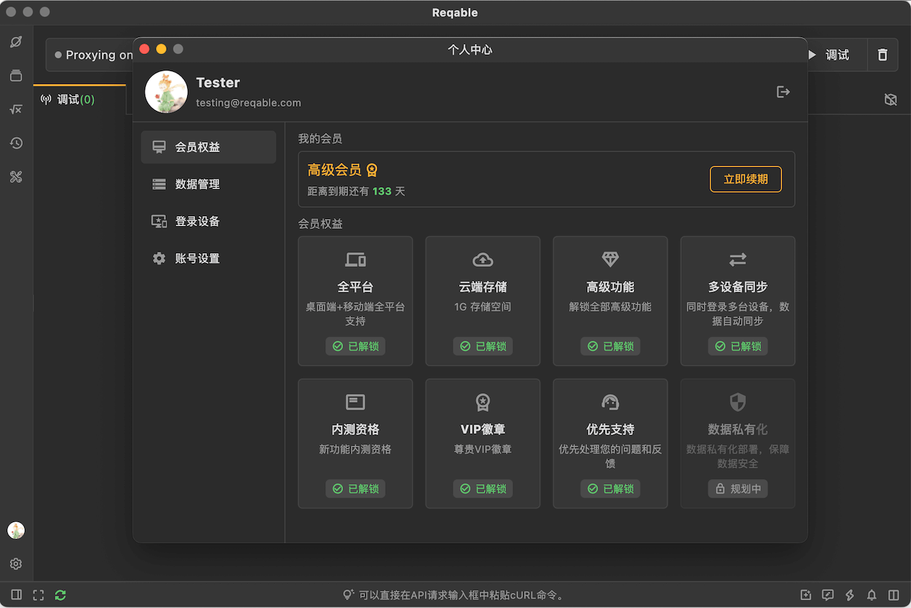
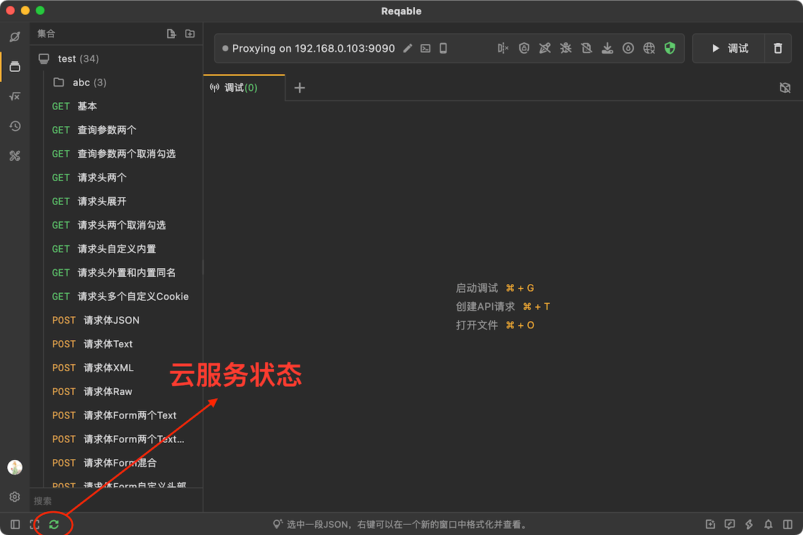
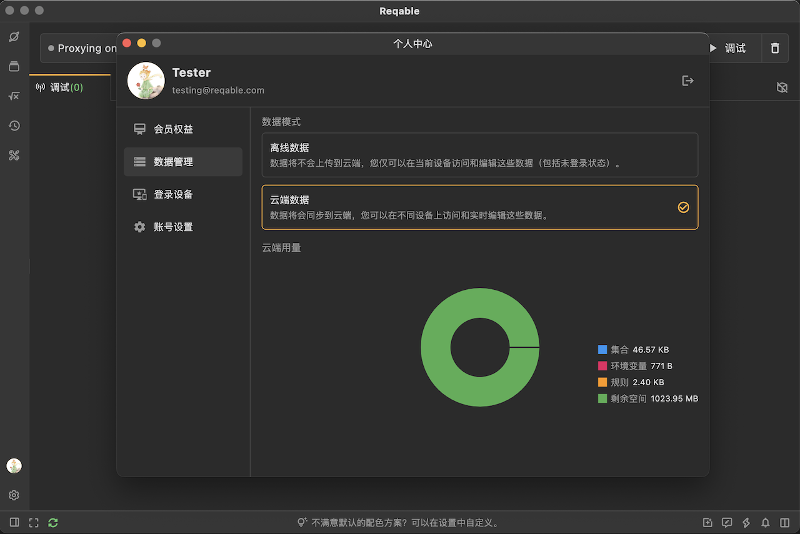
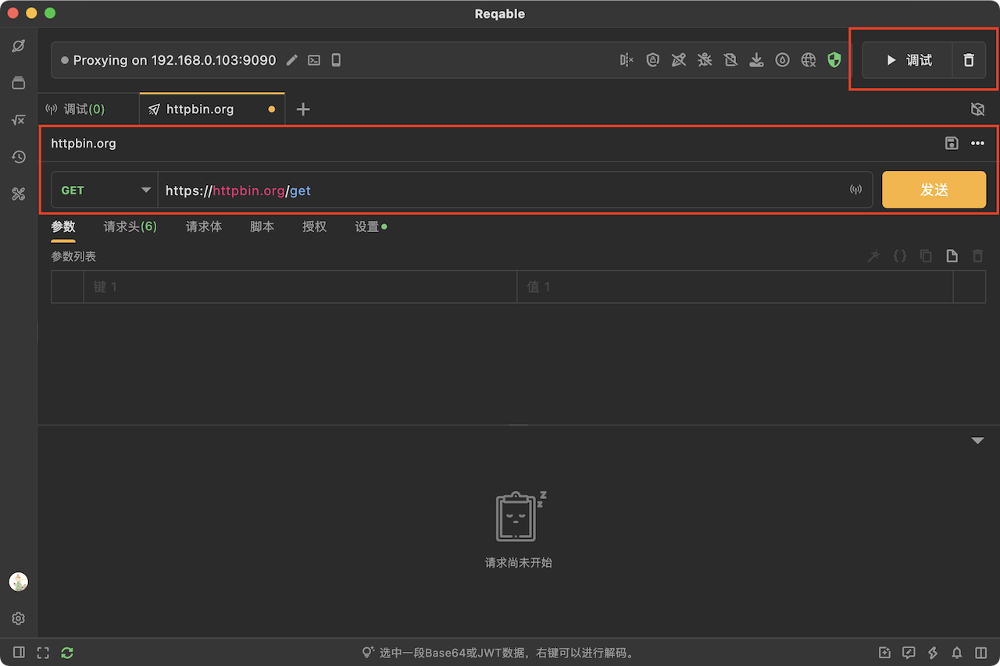
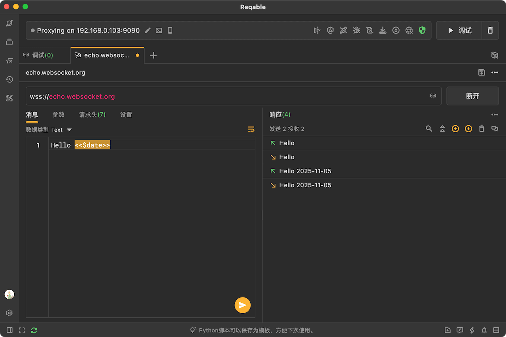
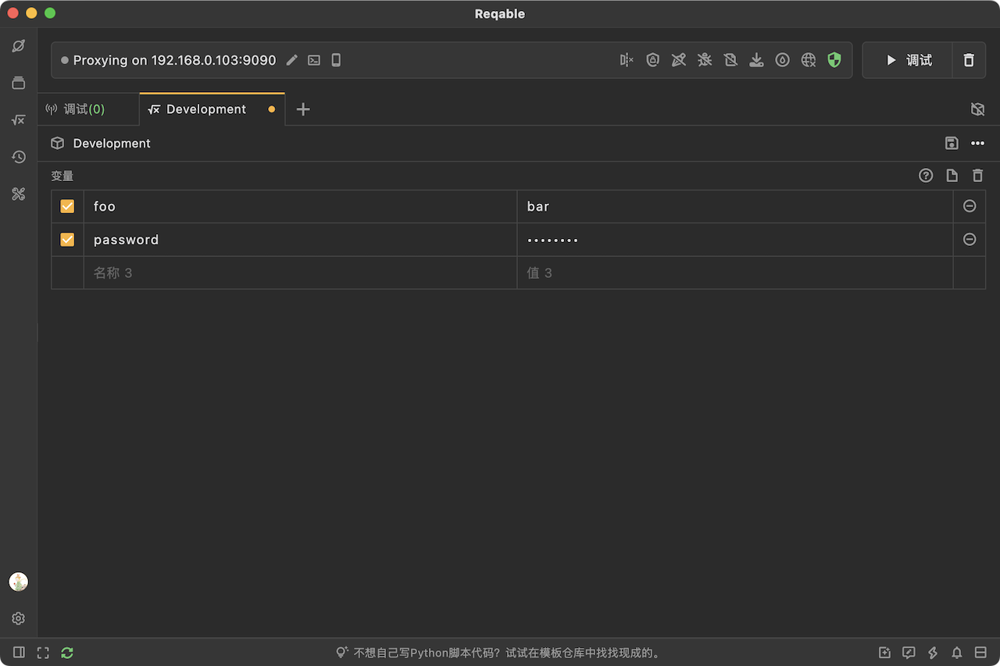
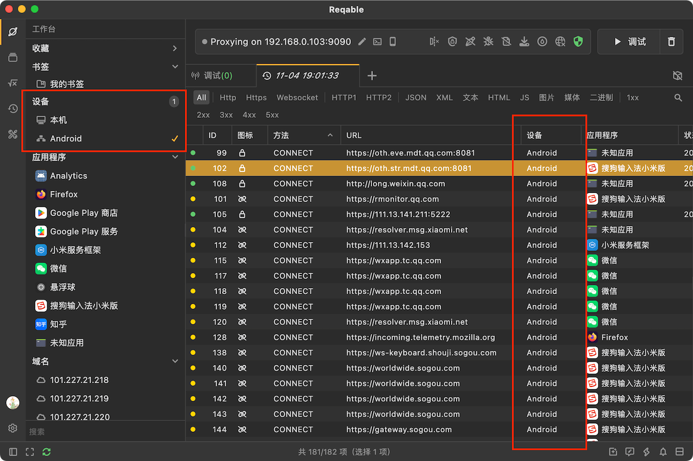
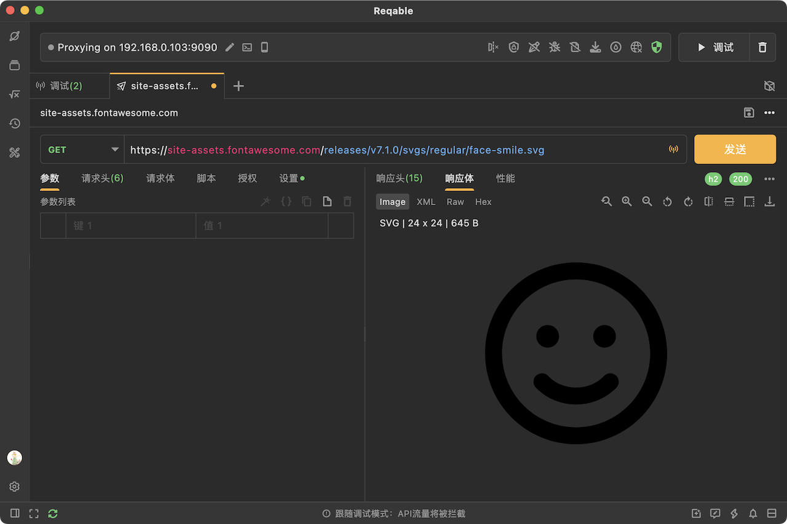

大家好，经过4个月的辛苦开发和2个月的Beta测试，我们今天非常高兴地对外正式发布Reqable 3.0版本，这里给大家分享下3.0版本的更新内容。

### 1. 许可证授权迁移到会员授权

由于3.0版本开始将支持数据云存储和多设备同步，因此我们重做了会员体系，付费机制由之前的许可证授权改为会员账号授权。**专业版用户的权益可以选择迁移为新版本高级会员，无需额外付费，社区版用户也可以免费注册为基础会员，各项权益只增不减**。后续邮箱密码将作为用户登录凭证，云端数据以账号作为凭证进行同步。

新版本我们取消了原专业版许可证的设备平台类型限制，同一个账号将支持在不同平台上同时登录，不限平台类型，但同样会有最多6台设备数量上限。

3.0版本除了常规邮箱密码登录外，还将支持微信、GitHub、Google和苹果（仅限iPhone）第三方授权登录。

账号登录入口仍然放在左下角（移动端仍在侧边栏顶部），成功登录后将显示为用户头像。如果是通过第三方授权（OAuth）进行账号注册，我们会自动获取第三方平台的邮箱、昵称和头像，如果是通过邮箱密码进行注册，我们会自动生成一个随机头像，用户后续可以打开个人中心窗口中进行修改。

:::warning
注意，由于新版本增强了密码信息摘要的强度，原许可证管理中心的账号密码不可用，需要重新注册。
:::

点击左下角头像可以进入个人中心，可以进行账号、数据和登录设备的管理。

:::caution
在个人中心，可以选择将旧版本的许可证迁移到新版本的高级会员，迁移后许可证将会自动注销，即无法在旧版本上进行授权；当然，也可以选择不迁移并继续使用旧版本。如果一个邮箱下面有多张许可证，可以选择转移到其他邮箱，也可以向我们申请给多余的许可证退款。
:::

### 2. 云服务和数据同步

云服务和数据同步是3.0版本最核心的新功能，用户的API集合、环境变量和调试规则数据可以自动上传到我们的云服务器，在其他设备上将会自动同步。其中，API集合和环境变量支持实时同步，任何修改在其他设备上立即可见，方便多人进行实时协作。

在窗口左下角，会显示一个云服务连接状态的图标，绿色表示连接状态正常。如果无法连接云服务器，用户将无法对API集合和环境变量进行修改（和Postman等工具机制一样），但不影响API测试。

:::note
数据实时同步的实现原理，并不是数据的整体上传和下载，而是每一步操作都会与服务器进行同步，要求客户端与服务器要完全同步，因此客户端离线时无法修改数据。
:::

云服务和数据同步对所有用户开放，包括免费用户，但是付费用户拥有更大的云端存储空间以及支持多设备登录同步。**我们强烈反对声称不限空间功能免费，攒一波用户后再花式收费割韭菜的做法。** 目前免费有限的存储空间足够满足绝大多数用户数据存储需求，对我们也没有成本困扰，如果真到了瓶颈，那你确实是该考虑付费了。**

如果有担忧到数据隐私安全，或者顾虑云服务的稳定性，可以选择在个人中心将数据模式切换到离线数据模式（默认是云端数据）。

离线数据和账户未登录时的数据为同一份，登录和登出账户对数据将不会有任何变更。离线模式下数据和旧版本一样，仅存储在设备本地，丢失后无法恢复。

:::caution
云端数据和离线数据在本地采用不同目录进行存储，切换后不会自动导入。但是从2.x版本升级到3.0版本后，会出现一次是否将旧版本离线数据导入到云端的弹窗提示，如果错过此次机会，后续只能手动将离线数据导出然后再在云端环境下手动导入。
:::

在云端存储空间不足或者超限时，我们会在右下角以通知形式进行提示。在上图窗口中，用户也可以查看各部分的用量，方便进行管理。

### 3. 主界面UI调整

我们对新版本的主界面UI进行了一些较大幅度的调整，主要为下图中的两个部分：

首先，新版本取消了调试按钮的强调色和修改了文案，强调色迁移到了API请求测试的发送按钮上。因为我们考虑到在API测试标签页下面发送按钮是高频使用组件，调试按钮可有可无不应该吸引使用者的注意，而在调试标签页下面，用户并不难找到右上角的调试开关，强调色没有太大意义。这个改动可能会让部分已经习惯的小伙伴不舒服，但相信大家后面会接受这个改动。

其次，新版本取消了发送按钮右侧的下拉菜单，放到了上面一栏中，并直接放出高频使用的保存按钮。同时，还会显示API请求在集合中的层级路径，点击层级可以直接跳转到对应的文件夹，或者点击名称直接进行API重命名。

### 4. WebSocket请求测试

新版本我们还新增了WebSocket的请求测试，并支持保存到API集合中（WS标识）。不过，目前暂时还不支持在调试模式中对WebSocket消息进行拦截修改，这部分功能我们会在后续的3.x版本迭代更新中逐步完成。

WebSocket标签页的布局和HTTP请求测试类似，支持Text和Binary消息发送，以及自定义请求头等。同样的，也支持在WebSocket中使用`<<>>`来引用环境变量。

### 5. 全新环境变量编辑界面

新版本还重做了环境变量编辑界面，环境变量不再以弹窗形式出现，而是加入到主界面的标签页中统一进行管理，如下图所示：

同其他的REST标签页布局类似，在变量列表上面可以进行标签和环境名称的修改，以及保存或者删除等操作。

### 6. 设备筛选和条件关联

对于流量列表，我们在侧边栏新增了一个设备筛选功能，默认情况下名称显示为设备IP，用户可以右键设置别名。同时，在列表中信息设备列（默认不开启，需要在列表顶部右键手动勾选）。

条件关联是指从上往下，书签筛选、设备筛选、应用筛选到域名筛选，筛选项逐级变少。比如设备筛选之后，应用可选列表仅显示已选择设备下的应用程序，应用程序筛选后，域名可选列表仅显示已选择应用下的域名。

### 7. SVG图片预览

新版本可以直接预览SVG格式图片，而不是仅仅显示XML文本。和其他图片类型，用户可对SVG图标进行放大、缩小、旋转和镜像等等操作。

### 8. 优化和BUG修复

这部分比较多，就不一一介绍了，有兴趣的小伙伴可以前往[更新日志](/docs/changelogs/)中进行查看。

### 9. 后续版本计划

3.0版本正式发布后，我们将恢复版本快速迭代，保持每周1-3个版本的速度，重点修复和优化历史遗留的问题和缺陷，包括一些性能问题。

在3.1版本，我们将重新设计一些底层机制，重新实现重写相关功能，解决依赖请求原始服务器等问题。

在3.2版本，计划将支持发送GRPC请求，以及Protobuf数据解析等功能。

最后，感谢大家的支持，Reqable立志做最好用的API工具。