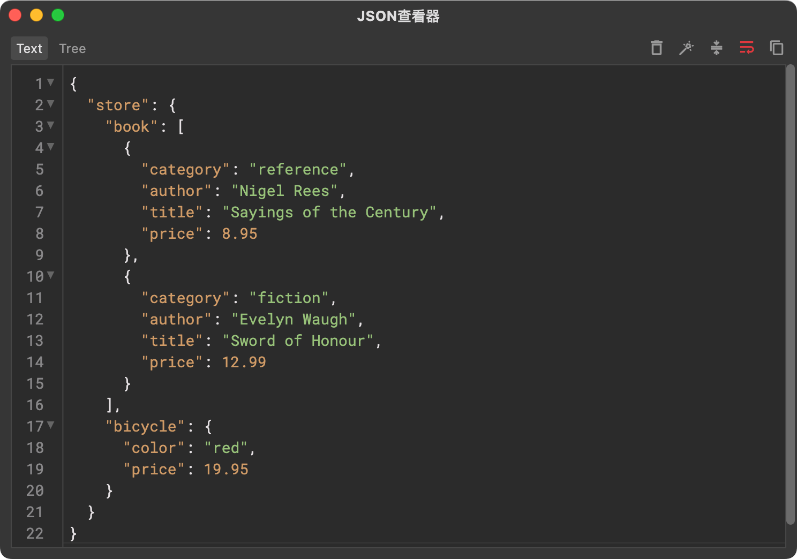
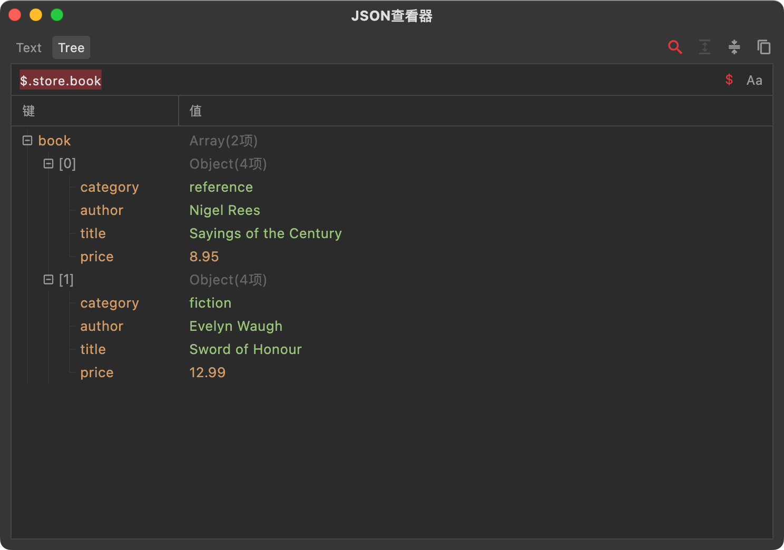
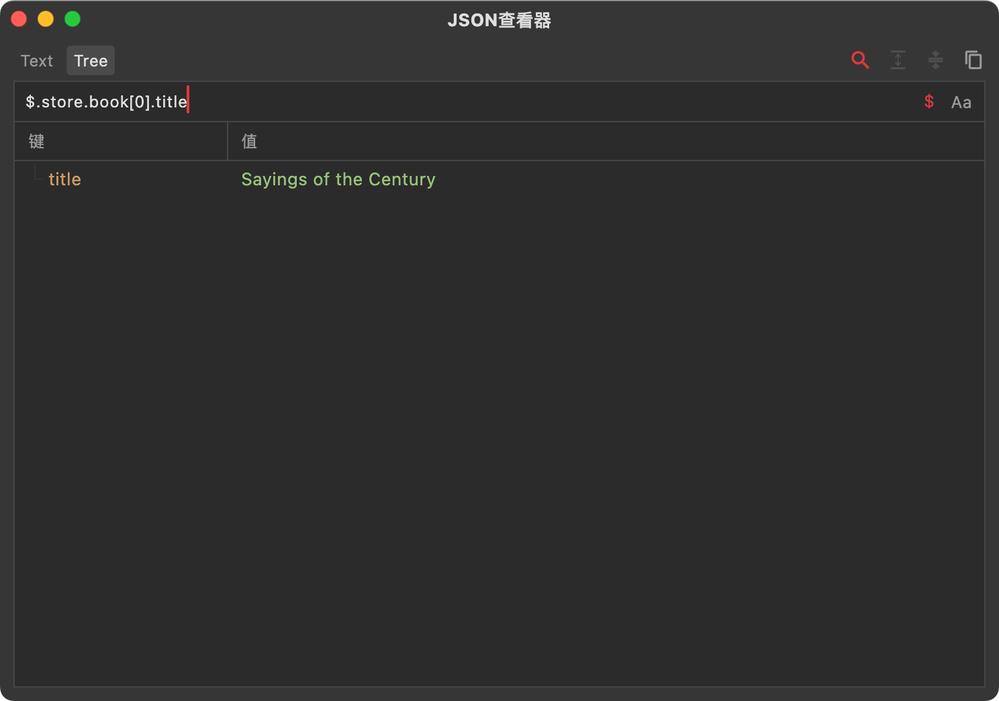
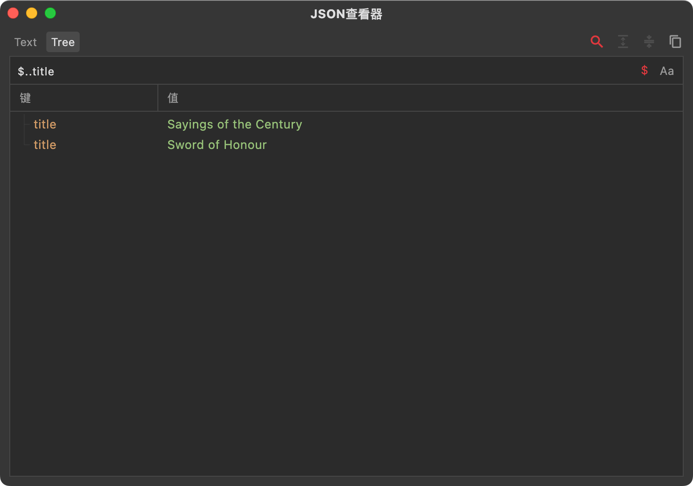
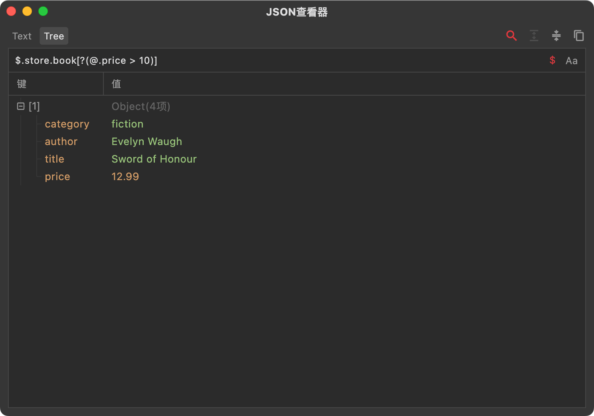
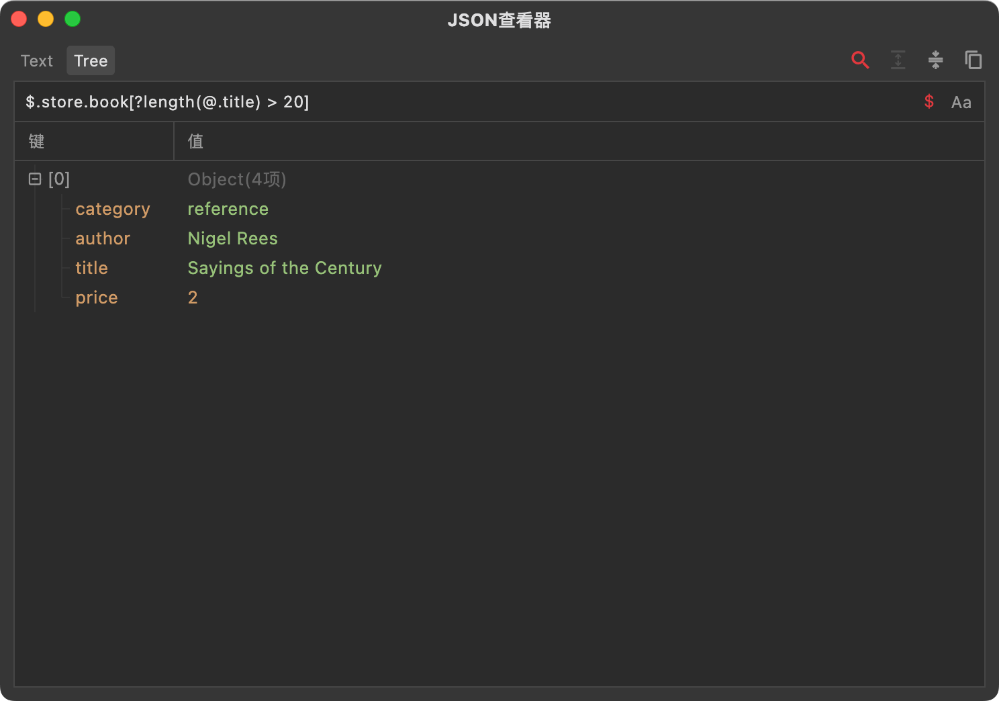
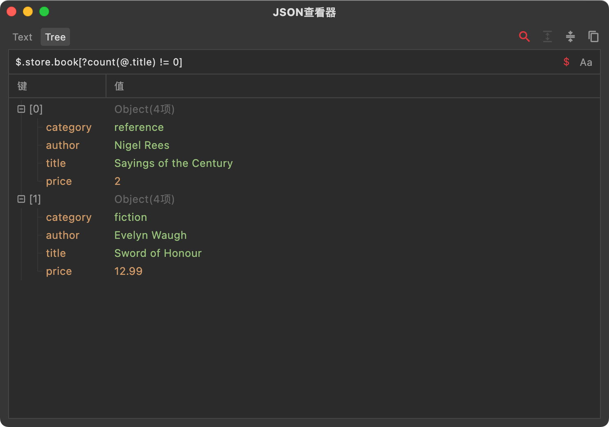
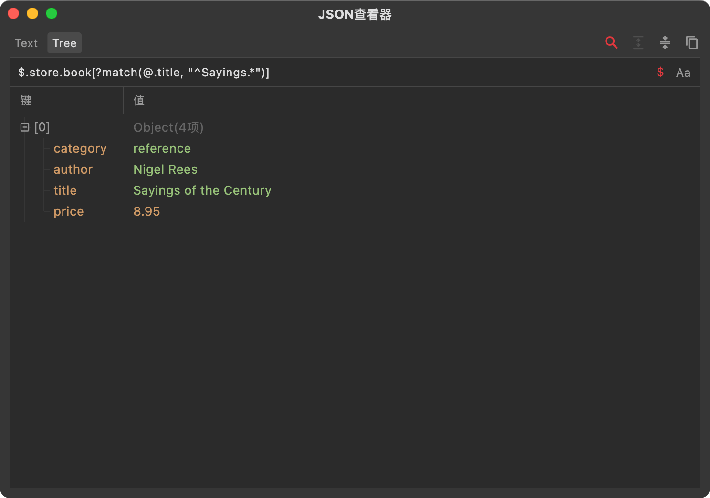
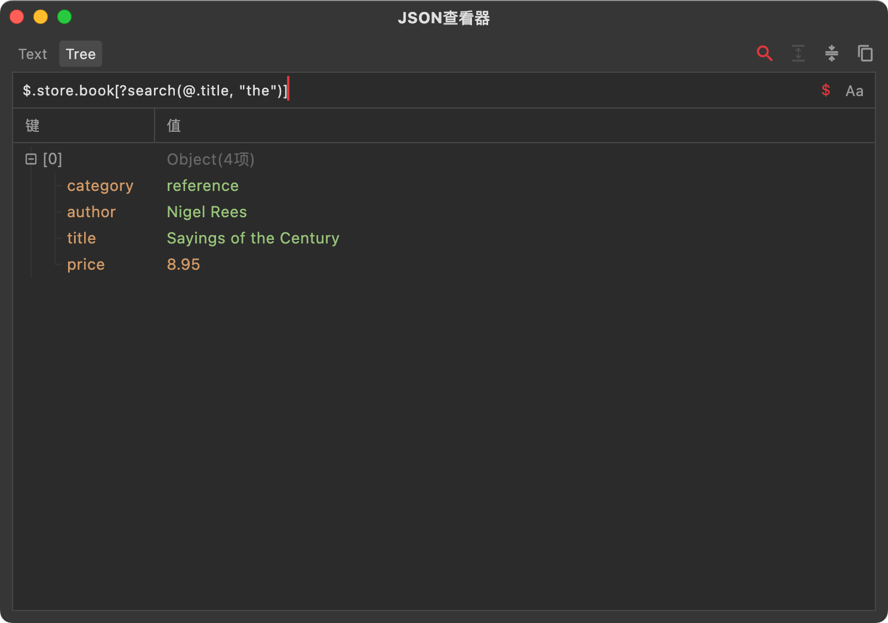
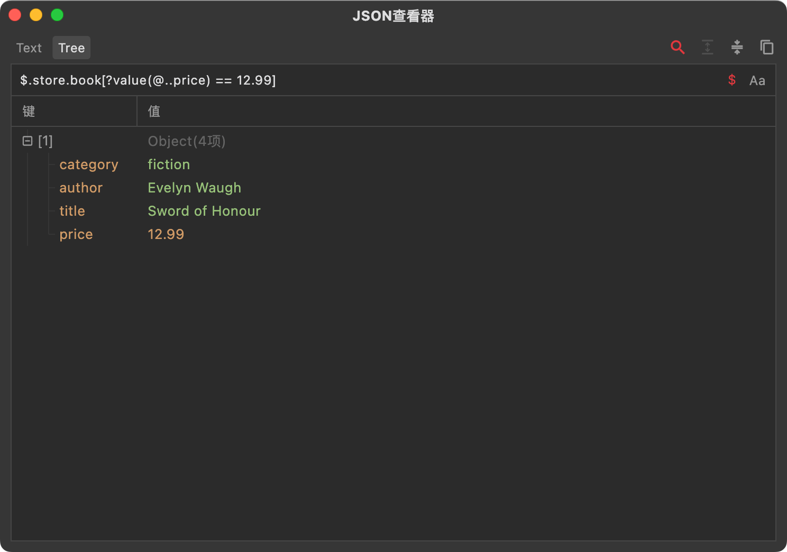

JSON Path是一种从JSON数据中搜索和提取特定内容的表达式。我们知道，对于复杂的JSON结构（例如多层级嵌套或者超大数组等），浏览和查找指定数据的效率非常低，因此一种类似正则表达式的语法就被创造了出来，这就是JSON Path。不过相比于正则表达式而言，这个语法相对来说要简单多了。

<!--truncate-->

# 1. 基本语法

首先是操作符，有下面几个：
- `$` 美元符号，表示JSON的根节点。由于我们数据需要从根节点开始处理，所以JSON Path表达式都是以$符号开头。

- `.` 单个点，表示当前节点下的子节点，后面紧跟节点键的名称。比如$.data表示根节点下的data节点，`$.data.foo`表示data子节点下的foo节点。

- `[]` 中括号，表示对节点操作。最常见的就是对数组节点通过索引获取子项，例如`items[0]`；还可以通过范围获取子项，例如`items[0:2]`，表示获取索引0-2范围内的全部子项；[]操作符内甚至还可以使用表达式，我们后面再详细讲解。

- `*` 星号，通配符，用于匹配任意键或者索引。比如`$.*`可以获取根节点下所有键的值；比如`items[*]`可以获取items数组中的所有子项。

- `..` 两个点，递归下降，可以匹配任意节点。比如`$..key`可以获取整个JSON中全部的键为key的节点。

- `@` 表示当前对象，通常在嵌套语法中使用。比如`$.key[?(@.foo=0)]`，中括号内的就是一个嵌套语法，`@.foo`表示key节点下的foo节点。

我们以下面这个JSON数据为例子，提供一些使用的表达式（在Reqable工具箱中可以找到下面例子中使用的JSON查看器）：

`$.store.book`表示提取store节点下的book节点（数组），效果如下：

`$.store.book[0].title`表示提取store节点下的book数组1项的title节点，效果如下：

`$..title`表示提取整个JSON数据中的全部的title节点，效果如下：

# 2. 数组操作

JSON Path的对象操作其实很简单，通过点操作符来获取对象的下一个节点，而数组的操作的语法相对就比较多了，我们下面来看。

第一种，最简单的索引取值，语法为`[index]`。例如`$.items[0]`，这个我们就不多讲了。

第二种，范围获取，语法为`[start:end]`。例如`$.items[0:2]`，表示获取items数组的前2项。

第三种, 步长获取，语法为`[start:end:step]`。例如`$.items[0:4:2]`，表示获取items数组的第0项和第2项，由于步长为2，因此跳过了第1项和第3项。

第四种，负索引，语法为`[-index]`。从数组队尾获取，例如-1表示数组最后一项，-2表示数组倒数第2项。

# 3. 表达式

对于大型数据集，我们可以使用表达式来提取数据，基本语法为
`[?(expression)]`，其中expression就是我们需要定义的过滤表达式，表达式支持比较操作符（>, <, >=, <=, ==, !=）和逻辑操作符（&&，||）。

例如还是下面这个JSON数据：

我们希望从中提取price大于10的book，可以使用过滤器
`$.store.book[?(@.price > 10)]`，其中`@.price > 10`就是一个比较表达式，其中@表示book当前对象。

# 4. 内置函数

对于复杂数据的复杂情况，光有表达式还不够，还需要一些函数来进行动态计算或者正则匹配，常用的内置函数有下面这些。

length函数，语法为`?length(expression)`，表示获取expression指定的值的长度。例如`$.store.book[?length(@.title) > 20]`，表示获取title长度大于20的数据。

count函数，语法为`?count(expression)`，表示获取expression指定数组的长度或对象属性个数。例如`$.store.book[?count(@.title) != 0]`，表示获取包含title属性的book，如果没有title属性函数就会返回0。

match函数，语法为`?match(expression, value)`，表示获取expression和value相匹配的数据，value必须是字符串，支持正则表达式匹配。例如`$.store.book[?match(@.title, "^Sayings.*")]`，表示获取title以Sayings开头的book。

search函数，语法为`?search(expression, value)`，表示获取expression包含value（也就是子字符串）的数据，value必须是字符串，支持正则表达式匹配。例如`$.store.book[?search(@.title, "the")]`，表示获取title包含the字符串的book。

value函数，语法为`?value(expression)`，表示将expression指定的节点类型转成值类型。如果expression是单节点，则返回此节点的值。如果expression是多节点，则转换失败返回空。例如`$.store.book[?value(@..price) ==12.99]`，表示获取price为12.99的book。注意这里的表达式`@..price`不是一个值，而是一个列表。如果这个列表元素个数是1，value函数会返回第一个元素的值；如果这个列表元素个数等于0或者大于1，则转换失败返回空。

