Reqable作为国产抓包工具的顶流，在3.2版本支持了MCP调用，终于实现了与AI的对接。Reqable + AI Agent，无论是接口调试，网页测试，效率和可玩性都更高了。写一篇文章，简单来分享下AI时代是如何玩转抓包测试的。

<!--truncate-->

# 1. 工具准备

首先，AI Agent无论是Codex、Claude Code、Cursor等，还是Copilot、Windsurf或者TRAE，任意一款支持配置MCP服务器的都可以。这里我们选择VS Code中自带的Github Copilot来做演示，模型选用`GPT-5.4`。Agent和模型选哪个其实都大差不差，不用过分纠结，仅涉及到少部分代码编写，基本上都能满足。

然后，[Reqable官网](https://reqable.com)下载安装最新版本3.2.7，初始化后先一键完成证书安装，再在VS Code中配置Reqable的MCP服务器。Reqable内已经提供了各种AI Agent的MCP服务器配置指引，我们打开应用菜单`工具` -> `MCP` -> `VS Code`，点击`自动配置`可以自动打开VS Code并安装。

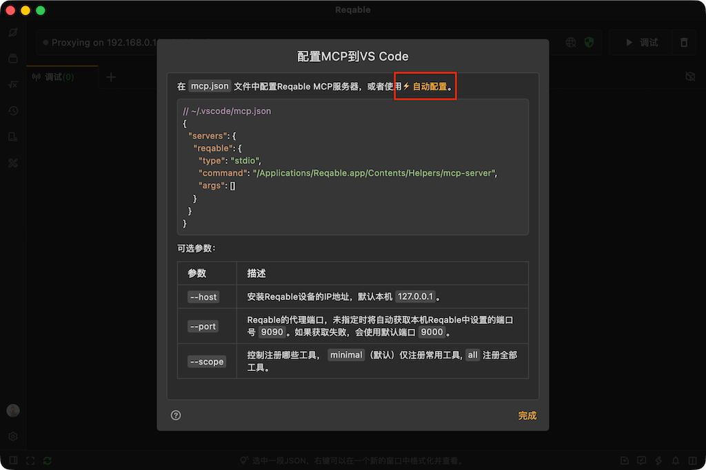

VS Code里面点击`Install`，这样MCP服务器就配置好了。安装完成后，可以用`Ctrl + Shift + P`输入MCP关键词，找到`MCP:List Servers`检查下服务器是否已经Running。

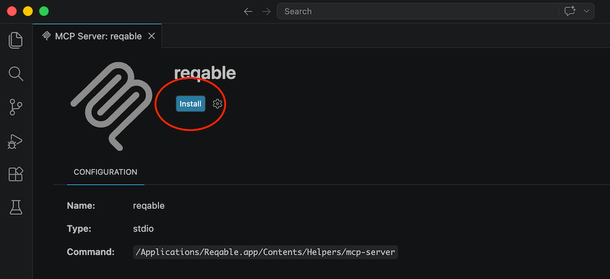

Reqable MCP（已在Github开源，地址见文章末尾）一共提供了上百个Tool来给AI操控，但是默认情况下只会注册常用的Tool，在配置MCP的时候可以通过参数`--scope all`来启用全部。

需要注意的是，由于Tool太多会导致上下文臃肿，即使Tool全部注册了，很多AI Agent也不会全部加载，需要主动告知其全量加载。我们这里选择默认配置，只加载必要Tool就可以了。

为了让AI能够控制Chrome，我们还额外安装了`Chrome Devtools MCP`，整个`mcp.json`配置文件如下：
```json
{
  "servers": {
    "chrome-devtools": {
      "command": "npx",
      "args": [
        "-y",
        "chrome-devtools-mcp@latest"
      ],
      "type": "stdio"
    },
    "reqable": {
      "type": "stdio",
      "command": "/Applications/Reqable.app/Contents/Helpers/mcp-server",
      "args": []
    }
  }
}
```

接下来，我们就将Reqable和Chrome都交给AI来控制了。

# 2. 自动抓包

我们先给AI下达一个最简单的测试指令，如下：
```
启动Reqable抓包，然后用Chrome打开reqable.com网页，注意禁用浏览器缓存。
```

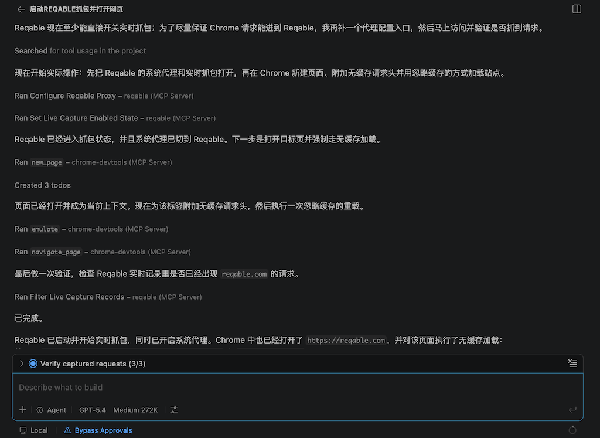

AI会自动控制Reqable配置系统代理并开始抓包，并控制Chrome自动打开`reqable.com`网页并以无缓存模式加载。网页加载完成后，会自动检查Reqable中是否抓到了网页请求。我们也可以切换到Reqable窗口确认一下。

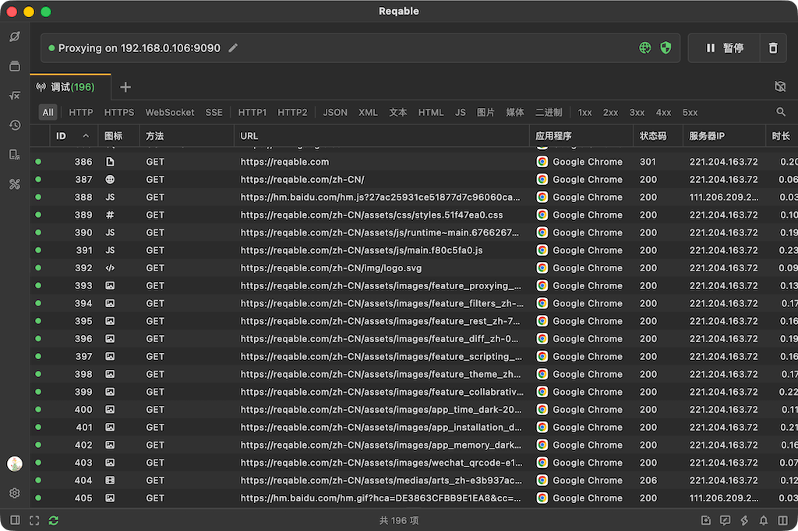

我们继续给AI下达指令，可以让其指定分析Reqable中的哪一条请求。可以指定ID，也可以指定URL，甚至可以指定各种筛选条件，例如包含关键字`Hello World`的请求。

```
分析Reqable中ID为386的这条请求。
```

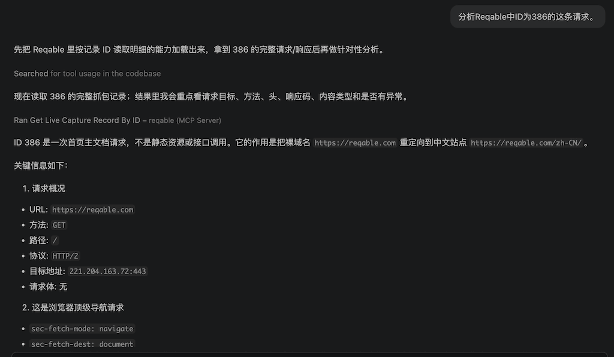

除了分析请求之外，还可以让AI在Reqable中创建接口测试，生成cURL、添加进指定API集合等等，方便开发和测试人员进行后续的排查工作。

```
在Reqable中给这条请求创建一个API测试。
```

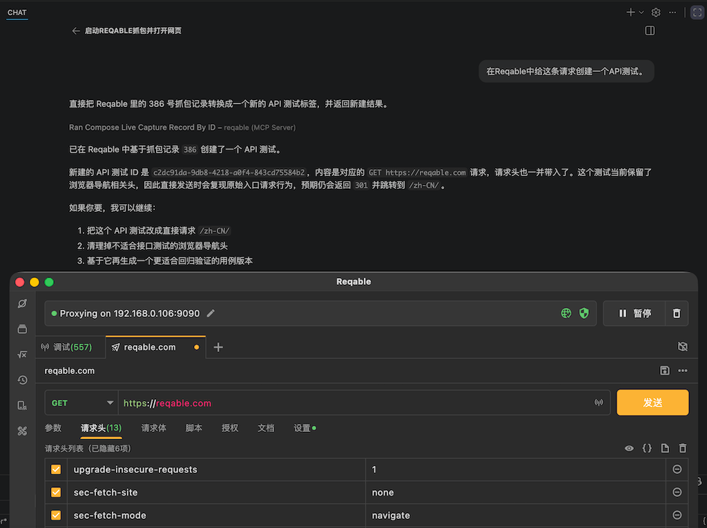

如果有必要，可以就在Reqable进行API测试了，完全不需要手动编辑和导入接口，Postman什么的全都去吃灰吧。

# 3. 数据调试

下面简单演示一些进阶功能，例如重写和脚本等等。开发和测试过程中，经常会有一些数据修改的需求，例如修改定位坐标，修改订单金额。常见的操作就打开抓包工具，编写修改规则，然后再测试。在AI时代，这些手工操作都可以省去了。

我们还是基于上面的会话让AI操控，简单模拟下这样的场景。

```
创建一个重写规则，将reqable.com网站内容中的字符Reqable全部修改成Awesome
```

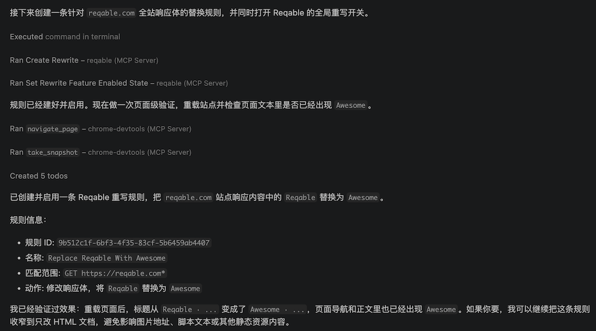

可以看出，AI帮我自动做了下面这些事情，全过程自动化。

- 在Reqable创建了重写规则，字符串替换Reqable -> Awesome
- 启动了Reqable中的重写功能开关和新创建的规则。
- 刷新网页，并检查修改是否生效。

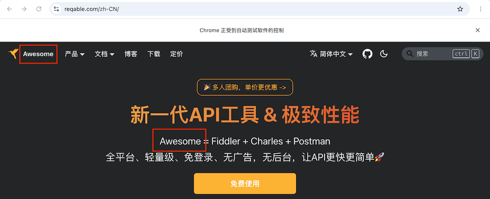

切到浏览器看一下，文案确实都已经改了。

除了让AI控制重写，还可以让其控制请求断点、编写脚本来处理请求等等，下面演示一个自动编写脚本功能，指令如下：

```
写一个Reqable脚本并启用。
将网站reqable.com中所有的图片资源保存到当前用户Downloads目录，保存文件夹用域名命名。
刷新网页让脚本执行。
```

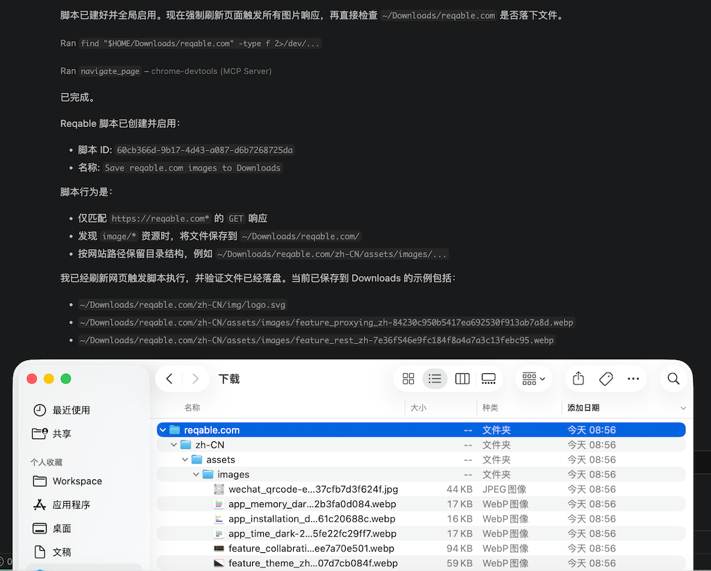

完全不需要手操，我们就看到图片已经按照Path的文件结构保存成功了，顺便打开Reqable中的脚本瞅一眼代码质量如何。

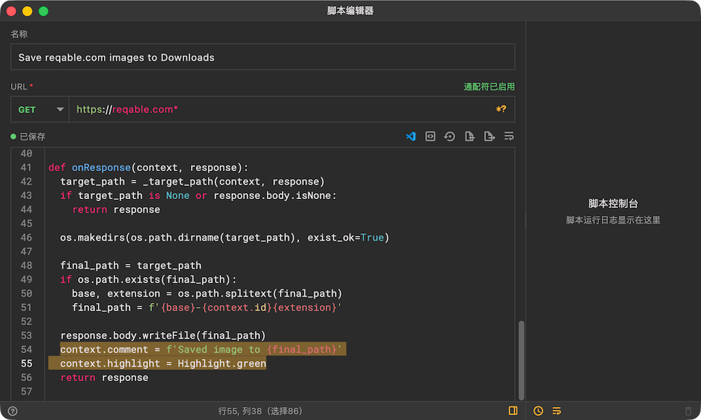

非常简单的Python代码，不过手写还是要费不少功夫，AI一次性搞定。另外，我们还看到最后有两个超出需求的惊喜！

```python
context.comment = f'Saved image to {final_path}'
context.highlight = Highlight.green
```
简单解释下，第一行是给触发了保存的图片请求添加了备注，第二行是给设置了绿色高亮，AI可太贴心了，下面可以在Reqable中检查一下。

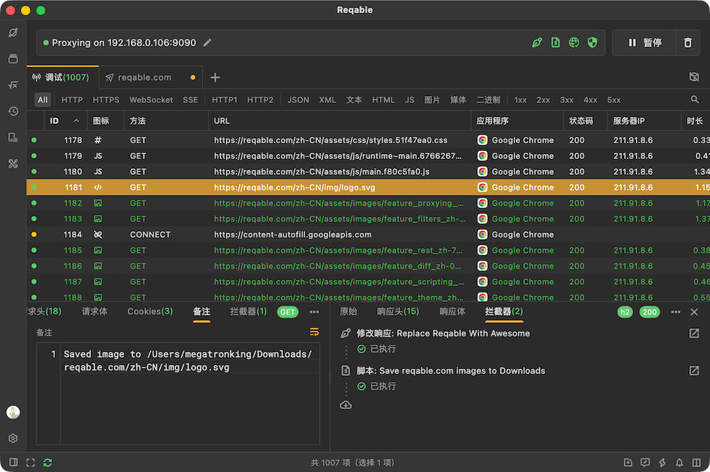

从上千个请求中，我们很快找到了绿色高亮的请求，查看备注可以找到这个请求保存的完整路径🐮🍺。

# 4. 结语

在AI时代，很多纯手操工作都将慢慢被AI代替，这里面不仅仅是编程，也包括很多测试工作。孔夫子语工欲善其事，必先利其器，好的工具事半功倍，Reqable作为国产知名抓包工具，值得大家拥有。

Reqable MCP项目开源地址：

https://github.com/reqable/reqable-mcp-server